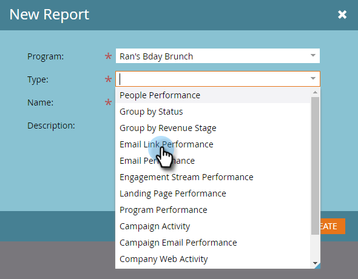

# Lien vers l’e-mail du rapport de performance de  {#email-link-performance-report}

Créez un rapport Performance de lien d’email pour voir les performances des liens de vos emails.

1. [Créer un rapport dans un programme](/help/marketo/product-docs/reporting/basic-reporting/creating-reports/create-a-report-in-a-program.md) et sélectionnez **Performances des liens email** comme type de rapport.

   

1. Cliquez sur **Configuration**.

   

1. Double-cliquez sur **Date de l’activité** under **Paramètres**.

   

1. Définissez une période appropriée pour votre rapport. Cliquez sur **Enregistrer**.

   

1. Cliquez sur **Rapport**.

   

1. Fantastique ! Vous avez maintenant créé un rapport Performance de lien d’email .

   

[Colonnes disponibles](/help/marketo/product-docs/reporting/basic-reporting/editing-reports/select-report-columns.md) pour un rapport Performance de lien de courrier électronique, procédez comme suit :

<table> 
 <thead> 
  <tr> 
   <th colspan="1" rowspan="1">Colonne</th> 
   <th colspan="1" rowspan="1">Description</th> 
  </tr> 
 </thead> 
 <tbody> 
  <tr> 
   <td colspan="1" rowspan="1">Lien</td> 
   <td colspan="1" rowspan="1">Regroupé par nom d’email. Cliquez sur le signe plus (+) pour afficher tous les liens inclus dans cet email.</td> 
  </tr> 
  <tr> 
   <td colspan="1" rowspan="1">Clics</td> 
   <td colspan="1" rowspan="1">Nombre de clics sur ce lien.</td> 
  </tr> 
  <tr> 
   <td colspan="1" rowspan="1">% Clics</td> 
   <td colspan="1" rowspan="1">Pourcentage du nombre total de clics sur tous les liens de cet email, sur ce lien.</td> 
  </tr> 
  <tr> 
   <td colspan="1" rowspan="1">Personne</td> 
   <td colspan="1" rowspan="1">Nombre de personnes uniques ayant cliqué sur le lien.</td> 
  </tr> 
  <tr> 
   <td colspan="1" rowspan="1">% Personne</td> 
   <td colspan="1" rowspan="1">Pourcentage du nombre total de personnes uniques ayant cliqué sur des liens dans cet email, sur ce lien.</td> 
  </tr> 
 </tbody> 
</table>

>[!NOTE]
>
>Ce rapport affiche &quot;Lien incorrect&quot; lorsque des liens non valides/vides sont ajoutés à un email. Si ce message s’affiche, [vérifier la source du HTML](/help/marketo/product-docs/email-marketing/general/functions-in-the-editor/edit-an-emails-html.md) dans l’éditeur de courrier électronique pour les liens vides ou les jetons qui ne renseignent pas un lien complet.

>[!TIP]
>
>Si vous voulez savoir exactement ce qu&#39;une personne a fait, vous pouvez ouvrir le [Journal d’activité](/help/marketo/product-docs/core-marketo-concepts/smart-lists-and-static-lists/managing-people-in-smart-lists/filter-activity-types-in-the-activity-log-of-a-person.md) dans le [Détails de la personne](/help/marketo/product-docs/core-marketo-concepts/smart-lists-and-static-lists/managing-people-in-smart-lists/using-the-person-detail-page.md) à partir de l’onglet Membres du programme.

>[!MORELIKETHIS]
>
>* [Rapport des performances des e-mails](/help/marketo/product-docs/email-marketing/email-programs/email-program-data/email-performance-report.md)
>* [Filtrage des ressources dans un rapport par courriel](/help/marketo/product-docs/reporting/basic-reporting/report-activity/filter-assets-in-an-email-report.md)

