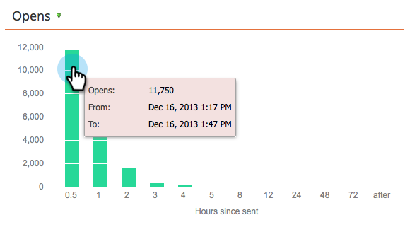
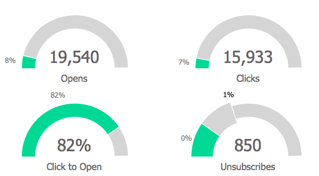

# Utiliser le Tableau de bord de Programme de courriel {#use-the-email-program-dashboard}

Découvrez comment vos programmes [de](http://docs.marketo.com/display/docs/email+programs) messagerie se comportent avec cette vue de tableau de bord.

>[!NOTE]
>
>Si votre programme comporte un test A/B, extrayez le Tableau de bord de Programme de [courriel - Vue](../../../../product-docs/email-marketing/email-programs/email-program-actions/email-test-a-b-test/use-the-email-program-dashboard-a-b-test-view.md)de test A/B.

>[!NOTE]
>
>Toutes les données de cette vue sont des agrégats (y compris le test A/B ainsi que l’envoi final par courrier électronique).

## Envoyer par courrier électronique {#email-send}

Vous pouvez voir ici combien de courriers électroniques ont été envoyés, renvoyés et distribués.

>[!NOTE]
>
>En raison des normes de délivrabilité des e-mails qui échappent au contrôle de Marketo, les statistiques de rebonds et de remises sont approximatives, pas exactes.

## Ouvre/Clics {#opens-clicks}

Ce graphique présente le nombre de courriers électroniques ouverts/sur lesquels les utilisateurs ont cliqué au cours de périodes spécifiques après l’exécution du programme de courrier électronique.

>[!TIP]
>
>Notez comment le nombre d’ouvertures/de clics diminue au fil du temps.

## Résumé - Engagement {#summary-engagement}

Ceci vous montre le score [global](../../../../product-docs/email-marketing/drip-nurturing/reports-and-notifications/understanding-the-engagement-score.md)d’engagement.

## Résumé - Repos {#summary-rest}

Le reste des données affiche les valeurs Ouvrir, Clics, Taux de clics/d’ouvertures et Désabonnements.

>[!TIP]
>
>Le taux de **désabonnement** dans l&#39;exemple ci-dessus était si faible que Marketo a zoomé pour vous donner un meilleur aperçu. Le deuxième numéro dans la barre est simplement ajouté pour l&#39;échelle.

>[!NOTE]
>
>**Définition**
>
>**Ouvre **sont comptabilisés lorsque le destinataire électronique télécharge les images du courrier électronique, ce qui inclut un pixel de suivi inséré par le marketing. Si le destinataire vue le courrier électronique mais choisit de ne pas télécharger ses images, cela ne sera pas comptabilisé comme une ouverture. Si les images se chargent dans le volet prévisualisation de l’destinataire, cela sera généralement comptabilisé comme une ouverture, mais cela variera en fonction du client de messagerie.
>
>**Cliquez pour ouvrir** mesure le pourcentage de courriers électroniques ouverts et sur lesquels un lien a été cliqué dans le courrier électronique. Nous prenons le nombre de clics uniques divisé par le nombre d&#39;ouvertures uniques, puis multiplions par 100 pour l&#39;afficher sous forme de pourcentage.

## Actualiser le Tableau de bord {#refresh-dashboard}

Pour afficher les données les plus récentes, il vous suffit de cliquer sur l’icône Actualiser du tableau de bord.

>[!MORELIKETHIS]
>
>* [Utiliser le Tableau de bord de Programme de courriel - Vue de test A/B](../../../../product-docs/email-marketing/email-programs/email-program-actions/email-test-a-b-test/use-the-email-program-dashboard-a-b-test-view.md)

>

