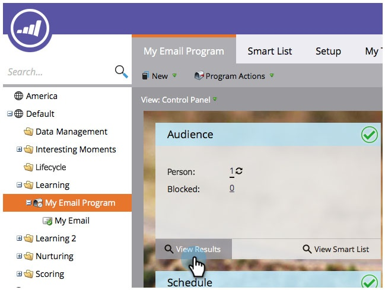

# Résultats du Programme de courriel de vue {#view-email-program-results}

Tout comme l’onglet Résultats des campagnes intelligentes, vous pouvez afficher les mêmes informations dans les programmes électroniques.

1. Accédez à **Activités marketing**.

   

1. Recherchez et sélectionnez votre programme de messagerie.

   

   >[!NOTE]
   >
   >Si le programme de messagerie a déjà été exécuté, vous serez dirigé directement vers le tableau de bord de programme de messagerie.

1. Sous **Vue**, sélectionnez **Panneau de Contrôle**.

   

1. Sous la mosaïque **Audience**, cliquez sur **Résultats de la Vue**.

   

   Voilà !

   

>[!NOTE]
>
>**Plongée profonde**
>
>Vous souhaitez en savoir plus sur les [Programmes de courriel](http://docs.marketo.com/display/docs/email+program+actions) ?

