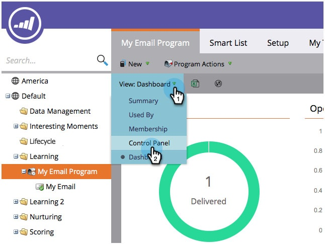
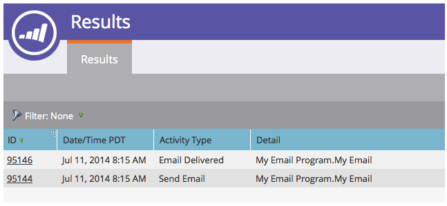

# Afficher les résultats du programme d’e-mail {#view-email-program-results}

Tout comme l’onglet [!UICONTROL Résultats] dans les campagnes intelligentes, vous pouvez voir les mêmes informations dans les programmes de messagerie.

1. Accédez à **[!UICONTROL Activités marketing]**.

   

1. Recherchez et sélectionnez votre programme de messagerie.

   

   >[!NOTE]
   >
   >Si le programme de messagerie a déjà été exécuté, vous serez redirigé directement vers le tableau de bord du programme de messagerie.

1. Sous **[!UICONTROL Affichage]**, sélectionnez **[!UICONTROL Panneau de Contrôle]**.

   

1. Sous le volet **[!UICONTROL Audience]**, cliquez sur **[!UICONTROL Afficher les résultats]**.

   

   Voilà !

   
