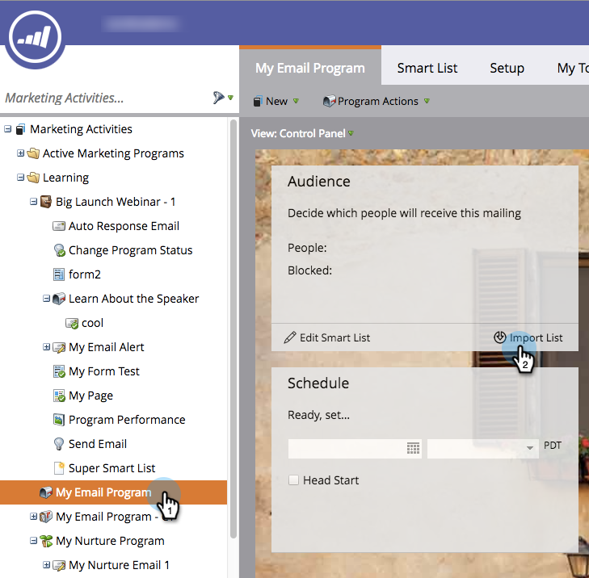

# Définition d’une audience en important une liste {#define-an-audience-by-importing-a-list}

>[!PREREQUISITES]
>
>[Créer un courrier électronique pour un programme de courrier électronique](/help/marketo/product-docs/email-marketing/email-programs/email-program-actions/create-an-email-for-an-email-program.md)

Une fois que vous avez créé un programme de messagerie, vous pouvez lui indiquer à qui envoyer l’email. Vous pouvez le faire en [créant une liste dynamique](/help/marketo/product-docs/core-marketo-concepts/smart-lists-and-static-lists/creating-a-smart-list/create-a-smart-list.md) ou en important une liste. Pour ce faire, importez une liste.

>[!NOTE]
>
>La définition de votre audience ne fonctionne que lorsque le programme de messagerie n’est pas approuvé.
>
>Les champs Date/Heure importés sont traités comme heure centrale. Si des champs Date/Heure se trouvent dans un fuseau horaire différent, vous pouvez utiliser une formule Excel pour les transformer en heure normale du Centre (Amérique/Chicago).

1. Accédez à **Activités marketing**.

   

1. Sélectionnez votre programme de messagerie, puis cliquez sur Importer la liste sous la mosaïque Audience .

   

1. La fenêtre d&#39;import de liste s&#39;ouvre, cliquez sur **Parcourir** et sélectionnez le fichier à importer. Une fois que vous avez sélectionné votre liste de personnes, cliquez sur **Suivant**.

   

   >[!CAUTION]
   >
   >Assurez-vous que la liste est codée au format UTF-8, UTF-16, Shift-JIS ou EUC-JP et que la taille du fichier ne dépasse pas 50 Mo.

1. Vérifiez que les champs de votre fichier sont correctement mappés et cliquez sur **Suivant**.

   

   >[!TIP]
   >
   >Marketo se souviendra des mappages pour les prochaines importations.

1. Saisissez un **Nom** pour votre liste et cliquez sur **Importer**.

   

1. Une fois l&#39;import terminé, revenez à l&#39;onglet du programme principal. Vous verrez combien de personnes seront admissibles.

   

>[!NOTE]
>
>**Définition**
>
>Avez-vous remarqué le numéro bloqué ? Ce nombre est un sous-ensemble des personnes qualifiées et représente les personnes qui ne peuvent pas être envoyées à cet email car elles sont :
>
>* Désabonné
>* Marketing interrompu
>* Figurant sur la liste de blocage
>* E-mail non valide
>* Email vide
>
>Cliquez sur le numéro pour obtenir une liste détaillée des personnes bloquées lors de l&#39;envoi du courrier.
>
>Utilisez le bouton  de la mosaïque **Audience** pour voir combien de personnes sont qualifiées pour recevoir l’email en fonction de critères de liste dynamique. Soustrayez le numéro bloqué du numéro Personnes pour obtenir le nombre total de personnes qui recevront l&#39;email.

>[!TIP]
>
>Il n’est pas nécessaire d’attendre la fin de l’importation de la liste. Tu peux continuer à travailler si tu veux.

Fantastique ! Il est maintenant temps de choisir un email déjà existant ou de créer un nouvel email à envoyer à ces personnes.

>[!MORELIKETHIS]
>
>* [Choisir un email existant](/help/marketo/product-docs/email-marketing/email-programs/email-program-actions/choose-an-existing-email.md)
>* [Créer un courrier électronique pour un programme de courrier électronique](/help/marketo/product-docs/email-marketing/email-programs/email-program-actions/create-an-email-for-an-email-program.md)
