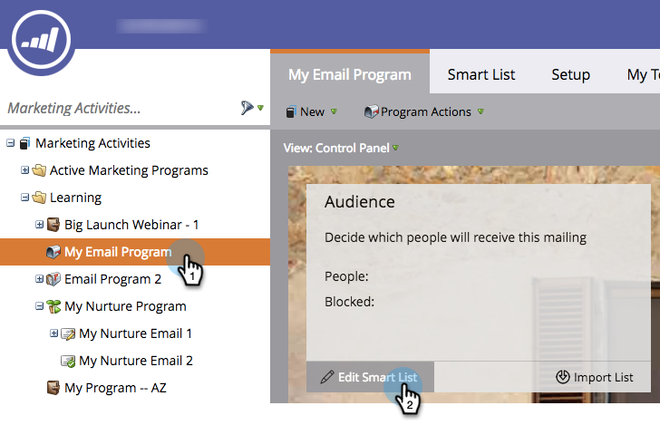

# Définir une Audience avec une Liste dynamique {#define-an-audience-with-a-smart-list}

Une fois que vous avez [créé un programme de courriel](../../../../product-docs/email-marketing/email-programs/creating-an-email-program/create-an-email-program.md), vous voudrez lui indiquer à qui envoyer le courriel. Pour ce faire, [importez une liste de personnes](define-an-audience-by-importing-a-list.md) ou utilisez une liste intelligente. Voici comment y parvenir avec une liste intelligente.

>[!PREREQUISITES]
>
>* [Créer un Programme de messagerie](../../../../product-docs/email-marketing/email-programs/creating-an-email-program/create-an-email-program.md)

>

>[!NOTE]
>
>**Rappel**
>
>La définition de votre audience ne fonctionnera que si le programme de messagerie n&#39;est pas approuvé.

1. Accédez à **Activités marketing**.

   

1. Sélectionnez votre programme de messagerie, puis cliquez sur **Modifier la Liste dynamique** sous la mosaïque **Audience**.

   

   >[!TIP]
   >
   >Assurez-vous que la Vue est définie sur **Panneau de Contrôle** pour trouver ce paramètre.

1. Recherchez le ou les filtres à utiliser et faites-les glisser dans la trame.

   

1. Définissez le ou les filtres.

   

   >[!NOTE]
   >
   >**Plongée profonde**
   >
   >
   >Consultez [listes intelligentes et listes statiques](http://docs.marketo.com/display/docs/smart+lists+and+static+lists) pour en savoir plus sur l&#39;utilisation et la définition des filtres.

1. Lorsque vous avez terminé d’ajouter et de définir des filtres, revenez à l’onglet programme principal. Vous verrez combien de personnes sont admissibles.

   

   Excellent travail ! Il est maintenant temps de [choisir un courriel existant](../../../../product-docs/email-marketing/email-programs/email-program-actions/choose-an-existing-email.md) ou de [créer un courriel](../../../../product-docs/email-marketing/email-programs/email-program-actions/create-an-email-for-an-email-program.md) à envoyer à ces personnes.

>[!NOTE]
>
>**Définition**
>
>Avez-vous remarqué le numéro bloqué ? Ce numéro est un sous-ensemble des personnes qualifiées et représente les personnes qui ne peuvent pas être envoyées par courriel car elles sont :
>
>* Non abonné
>* Marketing suspendu
>* Placé sur la liste bloquée
>* Adresse électronique non valide
>* Courrier électronique vide

>
>
Cliquez sur le numéro pour obtenir une liste détaillée des personnes bloquées dans les envois. **Veuillez noter que les courriels** opérationnels seront toujours envoyés aux personnes marquées comme non abonnées et le marketing suspendu.
>
>Utilisez le bouton  de la mosaïque d’Audience pour voir combien de personnes recevront le courrier électronique.

>[!MORELIKETHIS]
>
>* [Choisir un courriel existant](../../../../product-docs/email-marketing/email-programs/email-program-actions/choose-an-existing-email.md)
>* [Créer un courriel pour un Programme de courriel](../../../../product-docs/email-marketing/email-programs/email-program-actions/create-an-email-for-an-email-program.md)

>

