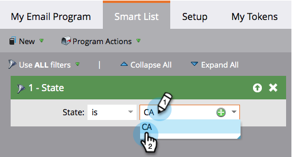

# Définition d’une audience avec une liste dynamique {#define-an-audience-with-a-smart-list}

Une fois que vous avez [créé un programme de messagerie](/help/marketo/product-docs/email-marketing/email-programs/creating-an-email-program/create-an-email-program.md), vous souhaiterez lui indiquer à qui envoyer l’e-mail. Vous pouvez le faire en [important une liste de personnes](/help/marketo/product-docs/email-marketing/email-programs/managing-people-in-email-programs/define-an-audience-by-importing-a-list.md) ou avec une liste dynamique. Voici comment y parvenir avec une liste dynamique.

>[!PREREQUISITES]
>
>[Créer un programme de messagerie](/help/marketo/product-docs/email-marketing/email-programs/creating-an-email-program/create-an-email-program.md)

>[!NOTE]
>
>La définition de votre audience ne fonctionne que lorsque le programme de messagerie n’est pas approuvé.

1. Accédez à **[!UICONTROL Activités marketing]**.

   

1. Sélectionnez votre programme de messagerie, puis cliquez sur **[!UICONTROL Modifier la liste dynamique]** sous la mosaïque **[!UICONTROL Audience]**.

   

   >[!TIP]
   >
   >Assurez-vous que la vue est définie sur **[!UICONTROL Panneau de Contrôle]** pour trouver ce paramètre.

1. Recherchez le ou les filtres que vous souhaitez utiliser et faites-les glisser dans la zone de travail.

   

1. Définissez le ou les filtres.

   

1. Lorsque vous avez terminé d’ajouter et de définir des filtres, revenez à l’onglet principal du programme. Vous verrez combien de personnes sont admissibles.

   

   Excellent travail ! Il est maintenant temps de [choisir un e-mail existant](/help/marketo/product-docs/email-marketing/email-programs/email-program-actions/choose-an-existing-email.md) ou [créer un e-mail](/help/marketo/product-docs/email-marketing/email-programs/email-program-actions/create-an-email-for-an-email-program.md) à envoyer à ces personnes.

>[!NOTE]
>
>**Définition**
>
>Avez-vous remarqué le numéro bloqué ? Ce numéro est un sous-ensemble des personnes qualifiées et représente les personnes qui ne peuvent pas être envoyées à cet e-mail parce qu&#39;elles sont :
>
>* Désabonné
>* Marketing interrompu
>* Figurant sur la liste de blocage
>* E-mail non valide
>* Empty Email
>
>Cliquez sur le numéro pour obtenir une liste détaillée des personnes bloquées dans le publipostage. **Remarque :** les e-mails opérationnels seront toujours envoyés aux personnes marquées comme désabonnées et dont le marketing est suspendu.
>
>Utilisez le bouton  sur la mosaïque **[!UICONTROL Audience]** pour voir combien de personnes recevront l’e-mail.

>[!MORELIKETHIS]
>
>* [Choisir un e-mail existant](/help/marketo/product-docs/email-marketing/email-programs/email-program-actions/choose-an-existing-email.md)
>* [Créer un e-mail pour un programme de messagerie](/help/marketo/product-docs/email-marketing/email-programs/email-program-actions/create-an-email-for-an-email-program.md)
