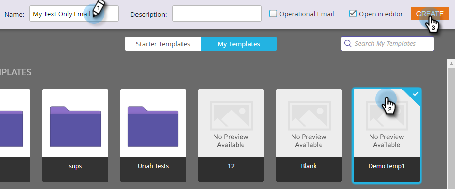

# Créer un courriel texte seulement {#create-a-text-only-email}

Si vous souhaitez envoyer des messages électroniques en format texte uniquement, voici comment créer un message qui sortira sans contenu HTML.

>[!NOTE]
>
>Comme les ouvertures sont suivies par le destinataire qui télécharge les images du courrier électronique (y compris un pixel de suivi invisible), les ouvertures ne peuvent pas être suivies pour les courriers électroniques au format texte seulement.****

1. Accédez à la zone **Activités marketing**.

   

1. Sélectionnez votre programme, cliquez sur la liste déroulante **Nouveau** et sélectionnez **Nouveau fichier local**.

   

1. Sélectionnez **Courriel**.

   

1. Saisissez un **nom**, sélectionnez un modèle et cliquez sur **Créer**.

   

1. Dans l’éditeur de courrier électronique, cliquez sur **Paramètres de courrier électronique**.

   

1. Cochez **Texte seulement** et cliquez sur **Enregistrer**.

   

   >[!CAUTION]
   >
   >Les liens ne sont pas automatiquement suivis dans les messages électroniques en texte seulement. Voir comment [Ajouter les liens suivis à un courriel de texte](/help/marketo/product-docs/email-marketing/general/functions-in-the-editor/add-tracked-links-to-a-text-email.md).

   >[!TIP]
   >
   >Vous pouvez également modifier un courrier électronique existant et modifier ce paramètre. N&#39;oubliez pas d&#39;approuver le brouillon.

1. Décochez la case **Copier automatiquement du code HTML**.

   

   >[!NOTE]
   >
   >Tout contenu ajouté à la section HTML du courrier électronique sera ignoré lors de son envoi.

1. Doublon-cliquez sur la zone de texte.

   

1. Modifiez votre texte et cliquez sur **Enregistrer**.

   

C&#39;est aussi facile que ça.
