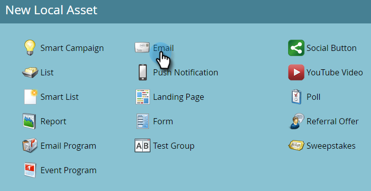

# Créer un e-mail {#create-an-email}

Il existe deux méthodes pour créer un email dans Marketo. Regardons les deux.

## Création d’un e-mail dans Design Studio {#create-an-email-in-the-design-studio}

1. Accédez au **[!UICONTROL Design Studio]**.

   

1. Cliquez sur le menu déroulant **[!UICONTROL Nouveau]** et sélectionnez **[!UICONTROL Nouvel e-mail]**.

   

   >[!NOTE]
   >
   >Lorsque vous créez un email dans le [!UICONTROL Design Studio], il se trouve dans l’arborescence sous « [!UICONTROL Emails] ».

Simple ! Maintenant, dans l&#39;autre sens...

## Créer un e-mail dans les activités marketing {#create-an-email-in-marketing-activities}

1. Accédez à **[!UICONTROL Activités marketing]**.

   

1. Sélectionnez le programme auquel vous souhaitez ajouter l’e-mail, cliquez sur le menu déroulant **[!UICONTROL Nouveau]** et sélectionnez **[!UICONTROL Nouvelle ressource locale]**.

   

1. Cliquez sur **[!UICONTROL Email]**.

   

   Et c&#39;est tout !

Quelle que soit la méthode choisie, vous accédez au sélecteur de modèles.

1. Attribuez un nom à votre e-mail, cliquez sur le modèle que vous souhaitez utiliser, puis cliquez sur **[!UICONTROL Créer]**.

   

   >[!NOTE]
   >
   >Vous pouvez choisir parmi une collection de modèles d’e-mail réactifs prêts à l’emploi ou un modèle que vous avez enregistré en sélectionnant d’abord **[!UICONTROL Mes modèles]** et en suivant les mêmes étapes.

1. Saisissez une ligne d&#39;objet. La limite recommandée de caractères est de 50.

   

   Selon le modèle que vous avez choisi, vous disposez de différentes options pour modifier votre e-mail. Pour les e-mails avec modules, consultez la section [Ajouter des modules à votre e-mail](/help/marketo/product-docs/email-marketing/general/email-editor-2/add-modules-to-your-email.md).

Votre e-mail est maintenant créé, n’effectuez plus de modifications.

>[!MORELIKETHIS]
>
>[Modifier L’En-Tête De Votre E-Mail](/help/marketo/product-docs/email-marketing/general/creating-an-email/edit-your-email-header.md)
