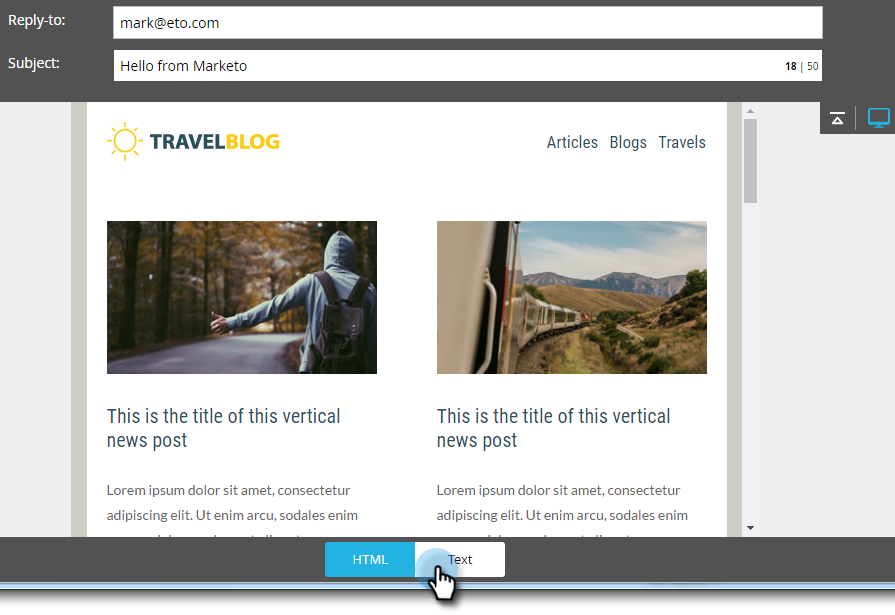

# Modification de la version textuelle d’un courrier électronique {#edit-the-text-version-of-an-email}

Lorsque vous créez un courrier électronique, vous pouvez souhaiter que sa version textuelle soit libellée différemment de la version HTML. Par défaut, Marketo copie automatiquement le contenu textuel de tout élément de texte enrichi contenu dans votre courrier électronique vers la version texte. Voici comment le modifier.

>[!NOTE]
>
>Il ne s’agit pas d’un article sur la création d’un courrier électronique au format texte uniquement. Pour plus d’informations à ce sujet, voir [Création d’un courrier électronique](create-a-text-only-email.md)texte uniquement.

1. Dans l’éditeur de courrier électronique, cliquez sur l’onglet **Texte** au bas du courrier électronique.

   

1. Décochez la case** Copier automatiquement du code HTML** pour apporter des modifications.

   

1. Doublon-cliquez sur la zone de texte.

   

1. Effectuez vos modifications. Une fois que vous avez terminé, fermez simplement l’éditeur ou revenez à la version HTML. Les modifications seront enregistrées automatiquement.

   \
   Si vous ne disposez que d’un contenu statique, le texte peut être modifié en un seul bloc (voir l’étape 3). Si vous disposez d’un contenu dynamique, le texte sera divisé en différentes sections modifiables, comme illustré ci-dessous.

   

Maintenant vous savez !
