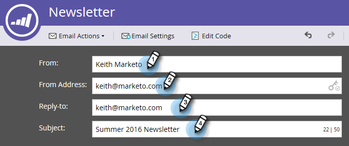

# Modifier votre en-tête de courriel {#edit-your-email-header}

L’en-tête de courrier électronique dans Marketing est entièrement personnalisable. Il se compose de quatre champs :

* **De**  : nom de l&#39;expéditeur tel que vous le souhaitez.
* **De l&#39;adresse**  : adresse électronique de l&#39;expéditeur telle que vous souhaitez qu&#39;elle apparaisse.
* **Réponse à**  : adresse électronique à laquelle vous souhaitez envoyer la réponse d&#39;une personne (peut être différente de l&#39;adresse de l&#39;expéditeur)
* **Objet**  - Objet du courriel

Pour modifier ces valeurs, cliquez dans chaque champ et entrez vos informations.

>[!TIP]
>
>Pour définir une valeur par défaut De nom et De courriel, voir [Modifier la valeur par défaut de l’adresse électronique et de l’étiquette ](/help/marketo/product-docs/administration/email-setup/change-the-default-from-email-and-from-label.md).

Si vous souhaitez utiliser un jeton, cliquez d’abord dans le champ de votre choix, puis cliquez sur l’icône de jeton.

Vous pouvez également rendre le champ dynamique en utilisant des segments.

L’icône de clé située à l’extrémité droite du champ Adresse de départ vous permet de savoir si vous utilisez une signature DKIM personnalisée.

Le compteur situé à l’extrémité droite du champ Objet vous permet de garder la ligne d’objet en dessous de la limite recommandée de 50 caractères.

Si vous dépassez 50 caractères, le compteur devient rouge pour vous alerter.

>[!MORELIKETHIS]
>
>[Présentation de l’éditeur de courrier électronique v2.0](/help/marketo/product-docs/email-marketing/general/email-editor-2/email-editor-v2-0-overview.md)
