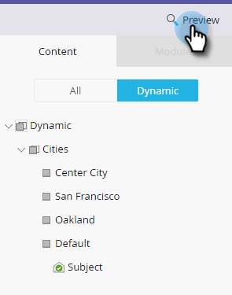

# Envoyer un exemple de courrier électronique {#send-a-sample-email}

Il est facile et rapide d&#39;envoyer des échantillons d&#39;un courriel. Pour envoyer un message électronique de contenu dynamique, voir [Prévisualisation d’un message électronique avec du contenu](../../../../product-docs/email-marketing/general/functions-in-the-editor/preview-an-email-with-dynamic-content.md)dynamique.

>[!NOTE]
>
>**FYI**
>
>Marketo est maintenant en train de normaliser la langue dans tous les abonnements. Vous pouvez donc voir des pistes dans votre abonnement et des personnes/personnes dans docs.marketo.com. Ces termes signifient la même chose ; cela n&#39;a aucune incidence sur les instructions relatives aux articles. Il y a aussi d&#39;autres changements. [En savoir plus](http://docs.marketo.com/display/DOCS/Updates+to+Marketo+Terminology).

>[!NOTE]
>
>Vous devez disposer de l’autorisation **Access Database - Run Single Flow Actions** pour envoyer des exemples de courriers électroniques.

## Envoyer un exemple de courrier électronique {#send-a-sample-email-1}

1. Recherchez et sélectionnez votre adresse électronique. Cliquez sur la liste déroulante Actions **de** courriel et sélectionnez **Envoyer un exemple**.\
   

   >[!NOTE]
   >
   >Mes jetons correspond à la valeur appropriée au programme du courrier électronique.

1. Entrez une adresse électronique pour la diffusion et cliquez sur **Envoyer**.

   

   >[!NOTE]
   >
   >**Rappel**
   >
   >
   >Pour entrer plusieurs adresses électroniques, séparez-les par des virgules.

   >[!TIP]
   >
   >Si vous souhaitez résoudre les jetons en tant que personne spécifique, choisissez cette personne dans la liste déroulante **** personne à l’étape 2.

## Envoyer un exemple de courrier électronique lors de la modification {#send-a-sample-email-while-editing}

1. Recherchez votre adresse électronique, sélectionnez-la et cliquez sur l’onglet **Modifier le brouillon** .

   

1. Cliquez sur Actions **** par courriel, puis sélectionnez **Envoyer un exemple**.

   

1. Entrez une adresse électronique pour la diffusion et cliquez sur **Envoyer**.

   

   >[!NOTE]
   >
   >Le champ de déclenchement ne s’applique qu’aux utilisateurs qui utilisent des scripts [de](http://developers.marketo.com/documentation/velocity-script/)courrier électronique.

## Envoyer un exemple de courrier électronique en fonction d’un segment {#send-a-sample-email-based-on-a-segment}

>[!PREREQUISITES]
>
>[Appliquez la segmentation à votre courrier électronique](http://docs.marketo.com/display/public/DOCS/Using+Dynamic+Content+in+an+Email).

1. Recherchez votre adresse électronique, sélectionnez-la et cliquez sur l’onglet **Modifier le brouillon** .

   

1. Cliquez sur **Prévisualisation**.

   

1. Cliquez sur la liste déroulante **Vue par** et sélectionnez **Segmentation**.

   

1. Une liste déroulante s’affiche avec les segments disponibles. Cliquez dessus et sélectionnez celui qui vous intéresse.

   

1. Utilisez les flèches pour faire défiler vos options (dans ce cas, nous avons modifié dynamiquement l’objet).

   

1. Cliquez sur **Envoyer l’échantillon** pour recevoir un courriel de test de votre segment en cours d’action.

   

   >[!TIP]
   >
   >Vous pouvez également envoyer un exemple de courrier électronique en fonction d’un segment en mode d’édition de votre courrier électronique. Cliquez sur la liste déroulante Actions **de** courriel, sélectionnez **Envoyer un exemple**, puis choisissez votre segment.

Il est très important d’échantillonner le contenu avant de lancer une campagne. Mesurez deux fois, coupez une fois !
