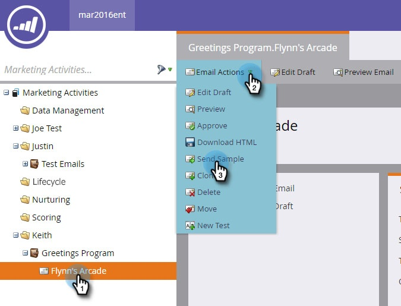
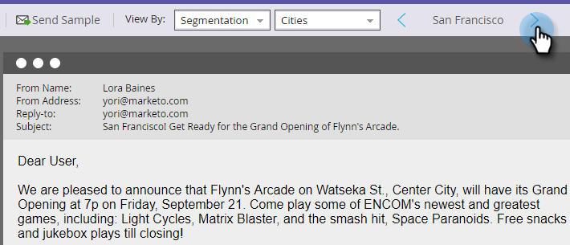

# Envoyer un exemple de courrier électronique {#send-a-sample-email}

Il est rapide et facile d&#39;envoyer des exemples d&#39;un email. Pour envoyer un email de contenu dynamique, voir [Prévisualisation d&#39;un email avec du contenu dynamique](/help/marketo/product-docs/email-marketing/general/functions-in-the-editor/preview-an-email-with-dynamic-content.md).

>[!NOTE]
>
>Vous devez disposer de l’autorisation **Accéder à la base de données - Exécuter des actions de flux unique** pour envoyer des exemples d’emails.

## Envoyer un exemple de courrier électronique {#send-a-sample-email-1}

1. Recherchez et sélectionnez votre email. Cliquez sur la liste déroulante **Actions de courrier électronique** et sélectionnez **Envoyer un exemple**.\
   

   >[!NOTE]
   >
   >My Tokens correspond à la valeur appropriée au programme de l’email.

1. Saisissez une ou plusieurs adresses email pour la diffusion. Pour plusieurs adresses électroniques, séparez-les par des virgules. Cliquez sur **Envoyer** une fois terminé.

   

   >[!IMPORTANT]
   >
   >Si vous saisissez plusieurs adresses email, elles seront toutes visibles par chaque destinataire. Le premier renseigné sera le destinataire principal et chaque adresse email suivante sera un destinataire CC.

   >[!TIP]
   >
   >Si vous souhaitez résoudre les jetons en tant que personne spécifique, sélectionnez cette personne dans la **liste déroulante de personne** de l’étape 2.

## Envoyer un exemple de courrier électronique lors de la modification {#send-a-sample-email-while-editing}

1. Recherchez votre email, sélectionnez-le et cliquez sur l’onglet **Modifier le brouillon** .

   

1. Cliquez sur **Actions de courrier électronique**, sélectionnez **Envoyer un exemple**.

   

1. Saisissez une adresse email pour la diffusion et cliquez sur **Envoyer**.

   

   >[!NOTE]
   >
   >Le champ déclencheur ne s’applique qu’aux utilisateurs de [script de courrier électronique](https://experienceleague.adobe.com/en/docs/marketo-developer/marketo/email-scripting).

## Envoi d’un exemple de courrier électronique basé sur un segment {#send-a-sample-email-based-on-a-segment}

>[!PREREQUISITES]
>
>[Appliquez une segmentation à votre email](/help/marketo/product-docs/email-marketing/general/functions-in-the-editor/using-dynamic-content-in-an-email.md).

1. Recherchez votre email, sélectionnez-le et cliquez sur l’onglet **Modifier le brouillon** .

   

1. Cliquez sur **Aperçu**.

   

1. Cliquez sur la liste déroulante **Afficher par** et sélectionnez **Segmentation**.

   

1. Une liste déroulante s’affiche avec les segments disponibles. Cliquez dessus et sélectionnez celui qui vous intéresse.

   

1. Utilisez les flèches pour faire défiler vos options (dans ce cas, nous avons modifié dynamiquement l’objet).

   

1. Cliquez sur **Envoyer un exemple** pour recevoir un email de test de votre segment en action.

   

   >[!TIP]
   >
   >Vous pouvez également envoyer un exemple d’email basé sur un segment en mode d’édition de votre email. Cliquez sur la liste déroulante **Actions de courrier électronique**, sélectionnez **Envoyer un exemple**, puis choisissez votre segment.

L’échantillonnage de votre contenu avant le lancement d’une campagne est très important. Mesurez deux fois, coupez une fois !
