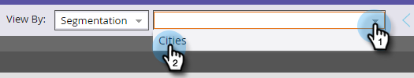

# Envoyer un exemple d’e-mail {#send-a-sample-email}

Il est rapide et facile d’envoyer des échantillons d’un e-mail. Pour envoyer un e-mail à contenu dynamique, voir [Prévisualiser un e-mail avec du contenu dynamique](/help/marketo/product-docs/email-marketing/general/functions-in-the-editor/preview-an-email-with-dynamic-content.md).

>[!NOTE]
>
>Vous devez disposer de l’autorisation **Base de données Access - Exécuter des actions de flux unique** pour envoyer des exemples d’e-mails.

## Envoyer un exemple d’e-mail {#send-a-sample-email-1}

1. Recherchez et sélectionnez votre e-mail. Cliquez sur le menu déroulant **[!UICONTROL Actions d’e-mail]** et sélectionnez **[!UICONTROL Envoyer un exemple]**.
   

   >[!NOTE]
   >
   >Mes jetons sont résolus sur la valeur appropriée au programme de l’e-mail.

1. Saisissez une ou plusieurs adresses e-mail pour la diffusion. Pour plusieurs adresses e-mail, séparez-les par des virgules. Cliquez sur **[!UICONTROL Envoyer]** lorsque vous avez terminé.

   

   >[!IMPORTANT]
   >
   >Si vous saisissez plusieurs adresses e-mail, elles seront toutes visibles pour chaque destinataire. Le premier champ renseigné sera le destinataire principal et chaque adresse e-mail suivante sera un destinataire en copie (CC).

   >[!TIP]
   >
   >Si vous souhaitez résoudre les jetons en tant que personne spécifique, choisissez cette personne dans le menu déroulant **personne** à l’étape 2.

## Envoyer un exemple d’e-mail lors de la modification {#send-a-sample-email-while-editing}

1. Recherchez votre e-mail, sélectionnez-le et cliquez sur l’onglet **[!UICONTROL Modifier le brouillon]**.

   

1. Cliquez sur **[!UICONTROL Actions e-mail]**, puis sélectionnez **[!UICONTROL Envoyer un exemple]**.

   

1. Saisissez une adresse e-mail pour la diffusion et cliquez sur **[!UICONTROL Envoyer]**.

   

   >[!NOTE]
   >
   >Le champ déclencheur ne s’applique qu’à ceux qui utilisent le [script d’e-mail](https://experienceleague.adobe.com/en/docs/marketo-developer/marketo/email-scripting).

## Envoyer un exemple d’e-mail en fonction d’un segment {#send-a-sample-email-based-on-a-segment}

>[!PREREQUISITES]
>
>[Appliquez la segmentation à votre e-mail](/help/marketo/product-docs/email-marketing/general/functions-in-the-editor/using-dynamic-content-in-an-email.md).

1. Recherchez votre e-mail, sélectionnez-le et cliquez sur l’onglet **[!UICONTROL Modifier le brouillon]**.

   

1. Cliquez sur **[!UICONTROL Aperçu]**.

   

1. Cliquez sur la liste déroulante **[!UICONTROL Afficher par]** et sélectionnez **[!UICONTROL Segmentation]**.

   

1. Une liste déroulante s’affiche avec les segmentations disponibles. Cliquez dessus et sélectionnez celui de votre choix.

   

1. Utilisez les flèches pour faire défiler vos options (dans ce cas, nous avons modifié l’objet de manière dynamique).

   

1. Cliquez sur **[!UICONTROL Envoyer un exemple]** pour recevoir un e-mail de test de votre segment en action.

   

   >[!TIP]
   >
   >Vous pouvez également envoyer un exemple d’e-mail en fonction d’un segment en mode d’édition de votre e-mail. Cliquez sur la liste déroulante **[!UICONTROL Actions d’e-mail]**, sélectionnez **[!UICONTROL Envoyer un exemple]**, puis choisissez votre segment.

L’échantillonnage de votre contenu avant le lancement d’une campagne est très important. Mesurez deux fois, coupez une fois !
