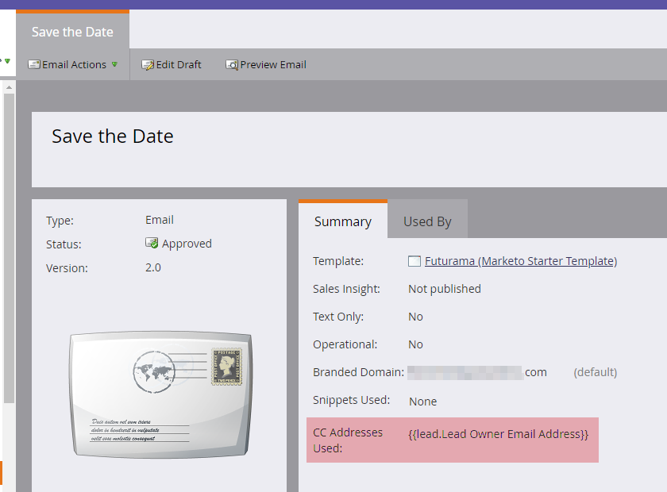

# Courriel CC {#email-cc}

Email CC permet aux courriers électroniques spécifiés envoyés par l’intermédiaire de Marketo d’inclure des destinataires CC.

Cette fonction est disponible sur toutes les ressources de courrier électronique de Marketing Cloud, quel que soit le mode d’envoi du courrier électronique (campagne par lot ou de déclenchement). Le destinataire CC recevra une copie exacte de l&#39;e-mail envoyé à la personne choisie pour le marketing. Ainsi, toute activité d’engagement (s’ouvre, clique, etc.) sera connecté au journal des activités de la personne du marketing dans la ligne &quot;À&quot; du courrier électronique. Toutefois, l’activité de diffusion (envoyée, livrée, rebond en dur, etc.) _autre que &quot;soft bounce&quot;_ ne  **** s&#39;enregistrera pas, car Marketo n&#39;est pas en mesure de distinguer les événements de diffusion pour la personne du marché des destinataires CC. Marketo ne contiendra que jusqu&#39;à 100 000 personnes à la fois. Si votre liste intelligente dépasse 100 000 et qu&#39;il est impératif que chaque personne y trouve un CC&#39;d, nous vous recommandons de briser votre liste.

>[!NOTE]
>
>Email CC n’a pas été conçu pour être utilisé avec des tests A/B. Vous pouvez l&#39;utiliser de toute façon si vous le souhaitez, mais comme il n&#39;est techniquement pas pris en charge, l&#39;assistance marketing ne serait pas en mesure de vous aider à résoudre les problèmes.

## Configurer le courrier électronique CC {#set-up-email-cc}

1. Dans Mon marketing, cliquez sur **Admin**.

   

1. Dans l’arborescence, sélectionnez **Courriel**.

   

1. Cliquez sur **Modifier les paramètres d’e-mail CC**.

   

1. Sélectionnez jusqu’à 25 champs de piste ou de Société marketing (de type &quot;E-mail&quot;) pour les rendre disponibles pour une utilisation en tant qu’adresses CC dans les courriels. Cliquez sur **Enregistrer** lorsque vous avez terminé.

   

## Utilisation d’Email CC {#using-email-cc}

1. Sélectionnez votre adresse électronique et cliquez sur **Modifier le brouillon**.

   

1. Cliquez sur **Paramètres de courriel**.

   

1. Sélectionnez jusqu’à cinq champs que vous souhaitez utiliser pour les personnes CC. Dans cet exemple, nous voulons uniquement le responsable de piste CC. Cliquez sur **Enregistrer** lorsque vous avez terminé.

   

   C&#39;est aussi simple que ça ! Dans l&#39;exemple ci-dessus, lorsque vous envoyez le courrier électronique, le propriétaire principal des destinataires que vous avez choisis sera CC&#39;d.

   >[!NOTE]
   >
   >Si une adresse électronique non valide se trouve dans un champ CC, elle est ignorée.

   Pour une identification rapide, la vue de résumé des courriels vous indique si/quels champs d’e-mail CC ont été sélectionnés.

   

   Si le courrier électronique est approuvé, mais que l’administrateur du marketing désactive un ou plusieurs des champs CC avant l’envoi du courrier électronique, **ces personnes ne recevront pas de courrier électronique**. Dans ce scénario, la vue de résumé du courrier électronique grise tous les champs qui ont été désactivés après l’approbation mais avant l’envoi :

   

   >[!NOTE]
   >
   >L&#39;erreur ci-dessus s&#39;affichera également dans la section Paramètres du courrier électronique du brouillon de courrier électronique.

## Après l’envoi de {#after-the-send}

* Si un destinataire CC clique sur un lien suivi dans le courrier électronique, cliquez sur activité (comme toute autre activité d’engagement) est associée au destinataire principal du courrier électronique. De plus, ils peuvent cliquer sur une page avec le code de suivi Web de Marketo (munchkin.js), ce qui les entraîne à recevoir des cookies en tant que destinataire principal.

>[!TIP]
>
>Vous avez la possibilité de [désactiver certains ou tous les liens de suivi](/help/marketo/product-docs/email-marketing/general/functions-in-the-editor/disable-tracking-for-an-email-link.md) dans un courrier électronique.

* Une fois la campagne par courrier électronique exécutée, l’option Envoyer l’activité par courrier électronique inclut une liste de toutes les adresses CC incluses pour chaque destinataire de l’envoi. Si des adresses CC ont été ignorées en raison de la désinscription, elles seront également notées dans l&#39;activité.
* Les liens et pages de désabonnement fonctionnent normalement dans les courriels CC. Cela permet aux destinataires CC de se désabonner s&#39;ils le souhaitent (en se conformant aux règles anti-spam), et un enregistrement de cette action sera stocké dans la base de données Marketo.
* Les personnes répertoriées comme désabonnées dans votre base de données Marketo **ne reçoivent** aucun courrier électronique via CC.
