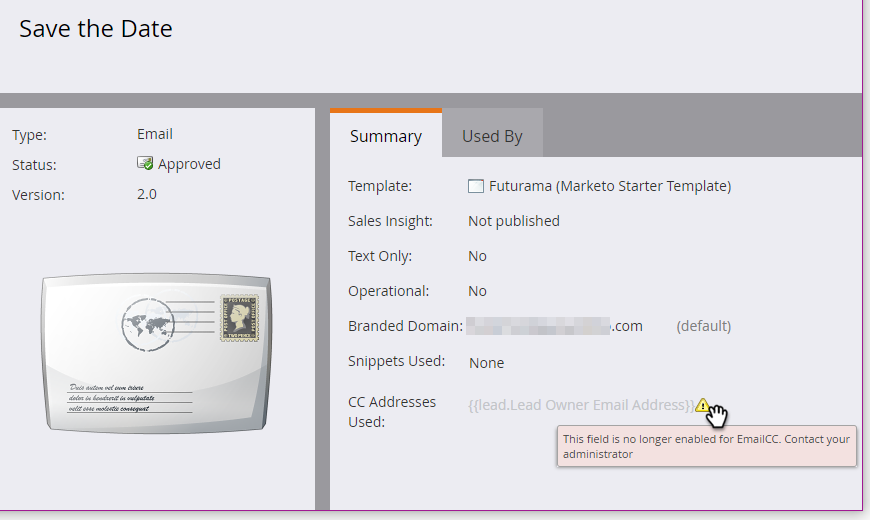

# Email CC {#email-cc}

Email CC permet l’envoi de courriers électroniques spécifiés via Marketo pour inclure des destinataires CC.

Cette fonctionnalité est disponible sur toutes les ressources de messagerie Marketo, quelle que soit la manière dont le courrier électronique est envoyé (par lot ou déclencher une campagne). Le destinataire CC recevra une copie exacte de l&#39;email envoyé à la personne Marketo choisie. Ainsi, toute activité d’engagement (ouvertures, clics, etc.) sera consigné dans le journal d’activité de la personne Marketo sur la ligne &quot;À&quot; de l’email. Cependant, l&#39;activité de diffusion (envoyée, diffusée, hard bounce, etc.) _autre que &quot;soft bounce&quot;_ s&#39;enregistrera **not**, car Marketo n&#39;est pas en mesure de distinguer les événements de diffusion pour la personne Marketo de ceux des destinataires CC. Marketo ne contiendra que 100 000 personnes à la fois. Si votre liste dynamique dépasse 100 000 et qu&#39;il est impératif que chaque personne y trouve des CC, nous vous recommandons de la diviser.

>[!NOTE]
>
>Email CC n’a pas été conçu pour être utilisé avec les tests A/B. Vous pouvez l’utiliser quand même si vous le souhaitez. Toutefois, comme il n’est techniquement pas pris en charge, le support Marketo ne peut pas vous aider dans le dépannage.

## Configurer Email CC {#set-up-email-cc}

1. Dans Mon Marketo, cliquez sur **Admin**.

   

1. Dans l’arborescence, sélectionnez **Email**.

   

1. Cliquez sur **Modifier les paramètres de CC de courrier électronique**.

   

1. Sélectionnez jusqu’à 25 champs Piste Marketo ou Société (de type &quot;Email&quot;) pour les rendre disponibles en tant qu’adresses CC dans les emails. Cliquez sur **Enregistrer** lorsque vous avez terminé.

   

## Utilisation d’Email CC {#using-email-cc}

1. Sélectionnez votre adresse électronique et cliquez sur **Modifier le brouillon**.

   

1. Cliquez sur **Paramètres de l’e-mail**.

   

1. Sélectionnez jusqu’à cinq champs que vous souhaitez utiliser pour les personnes CC. Dans cet exemple, nous voulons uniquement le propriétaire de piste CC. Cliquez sur **Enregistrer** une fois terminé.

   

   C&#39;est aussi simple que ça ! Dans l&#39;exemple ci-dessus, lorsque vous envoyez l&#39;email, le propriétaire des destinataires que vous avez choisis sera d.

   >[!NOTE]
   >
   >Si une adresse électronique non valide se trouve dans un champ CC, elle est ignorée.

   Pour une identification rapide, la vue Synthèse des emails vous indique si/lesquels des champs Email CC ont été sélectionnés.

   

   Si l&#39;email est approuvé, mais que l&#39;administrateur Marketo désactive un ou plusieurs des champs CC avant l&#39;envoi de l&#39;email, **ces personnes ne recevront pas d&#39;email**. Dans ce scénario, la vue Récapitulatif des emails grisera tous les champs qui ont été désactivés après validation mais avant envoi :

   

   >[!NOTE]
   >
   >L’erreur ci-dessus s’affichera également dans la section Paramètres du courrier électronique du brouillon de courrier électronique.

## Après l’envoi {#after-the-send}

* Si un destinataire CC clique sur un lien tracké dans l&#39;email, l&#39;activité de clics (comme toute autre activité d&#39;engagement) sera associée au destinataire principal de l&#39;email. En outre, ils peuvent cliquer sur une page avec le code de suivi Web de Marketo (munchkin.js), ce qui entraîne le cookie en tant que destinataire principal.

>[!TIP]
>
>Vous avez la possibilité de [désactiver certains ou tous les liens de suivi](/help/marketo/product-docs/email-marketing/general/functions-in-the-editor/disable-tracking-for-an-email-link.md) dans un email.

* Une fois une campagne par e-mail exécutée, l’activité Envoyer un e-mail inclut une liste de toutes les adresses CC incluses pour chaque destinataire de l’e-mail. Si des adresses CC ont été ignorées en raison d’un désabonnement, elles seront également signalées dans l’activité.
* Les liens et les pages de désabonnement fonctionnent normalement dans les emails CC. Cela permet aux destinataires CC de se désabonner s&#39;ils le souhaitent (en conformité avec les réglementations anti-spam), et un enregistrement de cette action sera stocké dans la base de données Marketo.
* Les personnes répertoriées comme désabonnées dans votre base de données Marketo recevront **not** par e-mail via CC.
