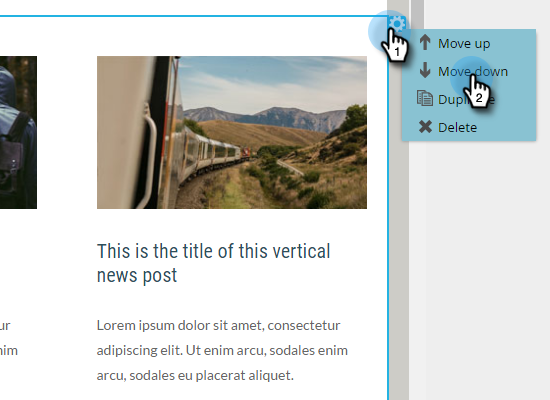

# Ajouter des modules à votre adresse électronique {#add-modules-to-your-email}

Dans la version 2.0 de l’éditeur de courrier électronique, un module est une section de votre courrier électronique définie dans le modèle. Les modules peuvent contenir toute combinaison d’éléments, de variables et d’autres contenus HTML. Il est facile de les Ajouter à votre courriel.

1. Créez un courrier électronique. Veillez à choisir (ou à créer) un modèle contenant des modules.

   

   >[!NOTE]
   >
   >La plupart des modèles de démarrage de marketing contiennent des modules. Vous pouvez également [créer votre propre ](/help/marketo/product-docs/email-marketing/general/email-editor-2/email-template-syntax.md#modules).

1. À l’extrémité droite du courrier électronique, cliquez sur **Modules**.

   

1. Choisissez le module à ajouter et faites-le glisser vers votre courrier électronique.

   

1. Lorsque vous faites glisser le module au-dessus, &quot;Déposez ici&quot; apparaît entre les autres modules. Déposez votre nouveau module là où vous le souhaitez.

   

1. Patientez quelques secondes et votre courrier électronique s’actualisera automatiquement, révélant ainsi le module que vous avez ajouté.

   

## Déplacement d&#39;un module dans un courrier électronique {#moving-a-module-within-an-email}

Il existe deux façons de déplacer un module.

1. Identifiez le module à déplacer. Si vous n&#39;êtes pas sûr de ce qu&#39;on appelle, passez le curseur dessus et il sera mis en surbrillance à droite.

   

1. Passez la souris sur le module à droite pour faire apparaître la poignée. Attrapez-le...

   

1. ...et faites glisser le module vers l&#39;emplacement souhaité.

   

1. L&#39;autre méthode consiste à cliquer sur le module dans le courriel pour le sélectionner, ce qui révèle l&#39;icône de l&#39;engrenage.

   

1. Cliquez sur l’icône d’engrenage, puis sélectionnez **Déplacer vers le haut** ou **Déplacer vers le bas**, selon l’emplacement où doit se rendre le module.

   

C&#39;est tout ce qu&#39;il y a à ça.

>[!MORELIKETHIS]
>
>[Syntaxe du modèle de courriel](/help/marketo/product-docs/email-marketing/general/email-editor-2/email-template-syntax.md)
