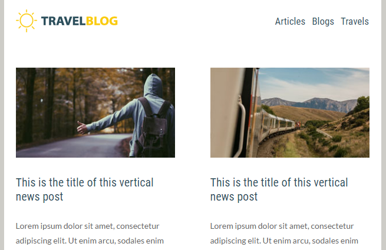
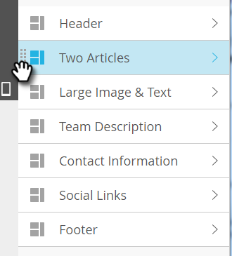

# Ajouter des modules à votre e-mail {#add-modules-to-your-email}

Dans [!DNL Email Editor 2.0], un module est une section de votre e-mail définie dans le modèle. Les modules peuvent contenir n’importe quelle combinaison d’éléments, de variables et d’autres contenus HTML. Il est facile de les ajouter à votre e-mail.

1. Créez un e-mail. Veillez à choisir (ou à créer) un modèle contenant des modules.

   

   >[!NOTE]
   >
   >La plupart des modèles Marketo [!UICONTROL Starter Templates] contiennent des [!UICONTROL modules]. Vous pouvez également [créer le vôtre](/help/marketo/product-docs/email-marketing/general/email-editor-2/email-template-syntax.md#modules).

1. À l’extrémité droite de l’e-mail, cliquez sur **[!UICONTROL Modules]**.

   

1. Choisissez le module que vous souhaitez ajouter et faites-le glisser sur votre e-mail.

   

1. Lorsque vous faites glisser le module sur vous, « Déposer ici » s’affiche entre les autres modules. Déposez votre nouveau module où vous le souhaitez.

   

1. Patientez quelques secondes, et votre e-mail s’actualisera automatiquement, affichant le module que vous avez ajouté.

   

## Déplacement d’un module dans un e-mail {#moving-a-module-within-an-email}

Il existe deux manières de déplacer un module.

1. Identifiez le module que vous souhaitez déplacer. Si vous n’êtes pas sûr de son nom, pointez la souris sur celui-ci pour le mettre en surbrillance à droite.

   

1. Pointez sur le module sur la droite pour afficher la poignée. Attrape-le...

   

1. ...et faites glisser le module où vous le souhaitez.

   

1. L’autre méthode consiste à cliquer sur le module dans l’e-mail pour le sélectionner et faire apparaître l’icône d’engrenage.

   

1. Cliquez sur l’icône d’engrenage, puis sélectionnez **[!UICONTROL Déplacer vers le haut]** ou **[!UICONTROL Déplacer vers le bas]**, selon l’emplacement souhaité pour le module.

   

C’est aussi simple que cela.

>[!MORELIKETHIS]
>
>[Syntaxe du modèle d’e-mail](/help/marketo/product-docs/email-marketing/general/email-editor-2/email-template-syntax.md)
