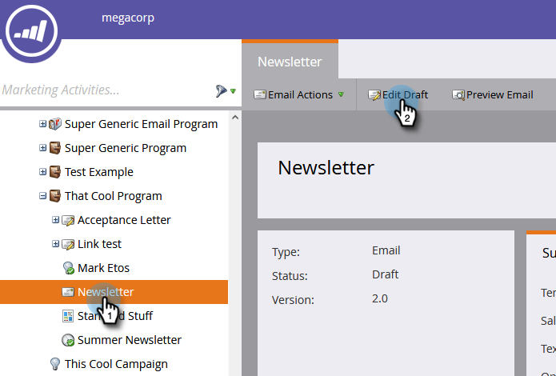

# Créer un modèle de courrier électronique {#create-an-email-template}

Pour créer un modèle de courrier électronique, procédez comme suit.

>[!NOTE]
>
>La prise en charge du marketing n’est pas configurée pour aider à résoudre les problèmes liés au code HTML personnalisé. Pour obtenir de l’aide sur HTML, veuillez consulter un développeur Web.

## Créer un modèle de courrier électronique {#create-a-new-email-template}

1. Cliquez sur **Design Studio**.

   

1. Cliquez sur **Nouveau**, puis sélectionnez **Nouveau modèle** de courriel.

   

1. Attribuez un nom à votre nouveau modèle et cliquez sur **Créer**.

   

1. Pour commencer à modifier votre nouveau modèle, cliquez sur **Modifier le brouillon**.

   

   >[!CAUTION]
   >
   >Bien qu’il n’y ait aucune limite stricte, une fois qu’un modèle de courrier électronique est utilisé par plus de 500 courriers électroniques, la réapprobation de ce modèle après une mise à jour peut entraîner des problèmes de performances. Nous vous recommandons de créer un nouveau modèle une fois qu’un modèle de courrier électronique comporte 500 courriers électroniques qui lui sont associés.

## Enregistrer un courriel en tant que modèle {#save-an-email-as-a-template}

Si vous avez créé un courrier électronique que vous souhaitez enregistrer en tant que modèle pour une utilisation ultérieure, procédez comme suit.

1. Cliquez sur Activités **** marketing.

   

1. Recherchez et sélectionnez votre adresse électronique, puis cliquez sur **Modifier le brouillon**.

   

1. Cliquez sur la liste déroulante Actions **de** courriel et sélectionnez **Enregistrer en tant que modèle**.

   

1. Cliquez sur la liste déroulante **Dossier** , sélectionnez l’emplacement où doit apparaître le modèle, puis cliquez sur **Enregistrer**.

   

   Et c&#39;est tout !

   >[!CAUTION]
   >
   >Lors de l’enregistrement d’un courrier électronique en tant que modèle, les valeurs de variable ne sont pas reportées. Les variables continueront à utiliser les valeurs par défaut spécifiées dans le modèle sous-jacent. Les modules disponibles dans le courrier électronique ne seront pas non plus reportés s’ils n’ont pas été insérés dans le corps du courrier électronique.

Pour personnaliser votre modèle de courrier électronique, consultez l’article ci-dessous.

>[!MORELIKETHIS]
>
>[Syntaxe du modèle de courriel](email-template-syntax.md)

