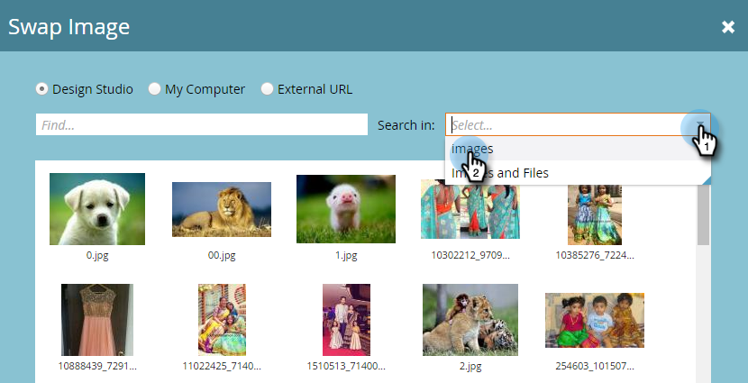

# Modifier des éléments dans un email {#edit-elements-in-an-email}

Les courriers électroniques peuvent contenir quatre éléments différents : du texte enrichi, des images, des fragments de code et de la vidéo. Voici comment les modifier.

## Comment modifier l’élément de texte enrichi {#how-to-edit-the-rich-text-element}

1. Recherchez votre email, sélectionnez-le et cliquez sur **Modifier le brouillon**.

   

1. L’éditeur de courrier électronique s’ouvre. Sélectionnez le texte enrichi, cliquez sur l’icône d’engrenage et sélectionnez **Modifier**.

   

   Vous pouvez également placer le pointeur de la souris sur l’élément dans le volet de droite, ce qui entraîne l’affichage de l’icône d’engrenage.

   

1. Ajoutez/modifiez votre texte et appuyez sur **Enregistrer**.

   

   >[!NOTE]
   >
   >Vous pouvez également ajouter des images, des jetons, des tableaux et d’autres éléments. Voir [Utilisation de l’éditeur de texte enrichi](/help/marketo/product-docs/email-marketing/general/understanding-the-email-editor/using-the-rich-text-editor.md).

   >[!CAUTION]
   >
   >Évitez de copier et de coller du texte à partir d’une source de texte enrichi, telle qu’un site web ou un document Word. Vous devez d’abord coller du texte enrichi dans un éditeur de texte brut, tel que Bloc-notes (Windows) ou TextEdit (Mac). Une fois qu’il est &quot;propre&quot;, vous pouvez le copier à partir de l’éditeur de texte brut et le coller dans votre email.

## Comment modifier l’élément d’image {#how-to-edit-the-image-element}

1. Cliquez à l’intérieur du module avec l’élément Image pour le sélectionner.

   

1. Cliquez sur l’élément Image à modifier, puis sur l’icône représentant un engrenage et sélectionnez **Modifier**.

   

   >[!NOTE]
   >
   >Vous pouvez également double-cliquer sur l’élément pour commencer l’édition.

1. L’éditeur d’image s’affiche.

   

   Vous disposez de trois options pour insérer une image. Regardons chacun.

   **URL externe**

   >[!NOTE]
   >
   >Si vous souhaitez utiliser un jeton Marketo, utilisez cette option. Gardez à l’esprit que lorsque vous utilisez un jeton, l’image apparaît rompue dans l’éditeur, mais son rendu est effectué en mode Aperçu et dans l’option Envoyer l’exemple d’email.

   Pour utiliser une URL externe, collez d’abord dans l’URL de l’image. Modifiez les dimensions en fonction de vos besoins et ajoutez du texte de remplacement (facultatif). Appuyez ensuite sur **Swap**.

   

   **Poste de travail**

   Pour télécharger une image depuis votre ordinateur, cliquez sur **Parcourir**.

   

   Accédez à l’emplacement de l’image sur votre ordinateur et insérez-la.

   

   Modifiez les dimensions en fonction de vos besoins, modifiez le texte de remplacement (facultatif), puis appuyez sur **Permuter**.

   

   >[!NOTE]
   >
   >Si vous remplacez une image, vous devrez cocher la case **Remplacer l’image existante** qui s’affiche sous l’URL/le nom de l’image.

   **Design Studio**

   Pour insérer une image de Design Studio, localisez-la simplement...

   

   ...et insérez-le. Modifiez les dimensions en fonction de vos besoins, modifiez le texte de remplacement (facultatif), puis appuyez sur **Permuter**.

   

## Comment modifier l’élément de fragment de code {#how-to-edit-the-snippet-element}

1. Cliquez dans le module avec l’élément Fragment de code .

   

1. Cliquez sur l’élément Fragment de code, puis sur l’icône d’engrenage et sélectionnez **Modifier**.

   

1. Recherchez votre extrait de code, sélectionnez-le, puis cliquez sur **Enregistrer**.

   

1. Votre extrait de code est ensuite renseigné.

   

## Modification de l’élément vidéo {#how-to-edit-the-video-element}

1. Cliquez à l’intérieur du module avec l’élément Vidéo .

   

1. Cliquez sur l’élément Vidéo, puis sur l’icône d’engrenage et sélectionnez **Modifier**.

   

1. Collez l’URL de la vidéo à partir de Vimeo ou de YouTube. Cliquez ensuite en dehors de la zone URL pour que l’aperçu soit chargé. Modifiez les dimensions en fonction de vos besoins, ajoutez Texte de remplacement (facultatif), puis appuyez sur **Insérer**.

   

   >[!NOTE]
   >
   >Pour les vidéos YouTube, utilisez l’URL complète de la barre d’adresse, et non l’URL de raccourci de l’option Partager .

Amusez-vous à concevoir l&#39;email parfait !
