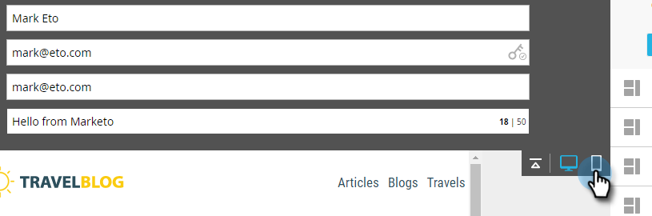
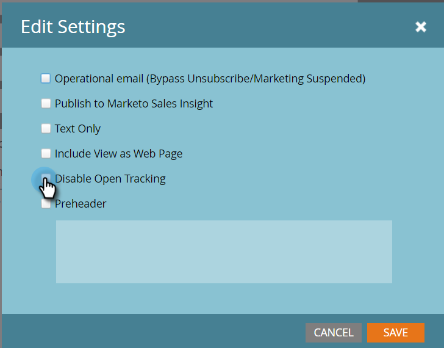

# Présentation de l’éditeur de messagerie v2.0 {#email-editor-v2-overview}

Lorsque vous décidez d’activer l’éditeur de courrier électronique v2.0, plusieurs nouvelles fonctionnalités s’affichent.

**Sélectionneur de modèle d’e-mail**

Lorsque vous créez un email, vous êtes dirigé vers le [sélecteur de modèle d&#39;email](/help/marketo/product-docs/email-marketing/general/email-editor-2/email-template-picker-overview.md).

**Éditeur de messagerie**

Lorsque vous commencez à éditer votre email, vous remarquerez que l&#39;éditeur a une toute nouvelle apparence.

**Modules**

Ces éléments du côté droit de l&#39;éditeur sont appelés modules. Découvrez comment [ajouter des modules à votre email](/help/marketo/product-docs/email-marketing/general/email-editor-2/add-modules-to-your-email.md).

**Version de texte**

Le passage de la version HTML à la version Texte de votre email se fait désormais dans un onglet pratique en bas de la page. Découvrez comment [modifier la version texte d’un email](/help/marketo/product-docs/email-marketing/general/creating-an-email/edit-the-text-version-of-an-email.md).

**En-tête de courrier électronique**

Vous voulez plus d&#39;espace design ? L&#39;en-tête de l&#39;email peut être masqué lorsque vous avez [terminé de le modifier](/help/marketo/product-docs/email-marketing/general/creating-an-email/edit-your-email-header.md). Cliquez simplement sur cette icône...

...et l’en-tête se réduit.

**Prévisualiser votre email**

Par défaut, l’email affiche l’apparence qu’il aurait sur un bureau, comme l’indique l’icône bleue en surbrillance. Si vous cliquez sur l’icône à sa droite...

...vous verrez comment votre email sera rendu sur un appareil mobile.

Pour obtenir un aperçu plus grand, cliquez sur **Preview** dans le coin supérieur droit de l&#39;email.

La vue par défaut est Bureau...

...mais vous pouvez également voir à quoi il ressemblera sur un appareil mobile. Vous pouvez également prévisualiser la version texte. Cliquez simplement sur **Modifier le brouillon** dans le coin supérieur droit pour reprendre la modification.

**Actions de courrier électronique**

Sous **Actions de courrier électronique**, vous remarquerez de nouvelles fonctionnalités. **Télécharger une image ou un fichier** et **Images de capture à partir du Web**. Vous pouvez également enregistrer l’email lui-même en tant que nouveau modèle d’email. Tout ce que vous avez à faire est de lui donner un nom et une destination.

>[!CAUTION]
>
>Lors de l’enregistrement d’un email en tant que modèle, les valeurs de variable ne seront pas transférées. Les variables continueront à utiliser les valeurs par défaut spécifiées dans le modèle sous-jacent. Les modules disponibles dans l&#39;email ne seront pas non plus reportés s&#39;ils n&#39;ont pas été insérés dans le corps de l&#39;email.

>[!NOTE]
>
>**[Grab Images from Web](/help/marketo/product-docs/demand-generation/images-and-files/grab-the-images-from-a-web-page.md)** fonctionne comme dans Design Studio.

**Désactiver le suivi des ouvertures** Sous **Paramètres des emails**, vous pouvez désactiver le suivi des ouvertures si nécessaire.

**Paramètres de courrier électronique**

Vous avez la possibilité d’ajouter un pré-titre. Un pré-titre est le texte de résumé court suivant l’objet lorsque les emails sont affichés dans votre boîte de réception.

>[!CAUTION]
>
>Les jetons ne fonctionnent pas dans le pré-titre lors de l&#39;utilisation de l&#39;éditeur d&#39;email. Pour utiliser un jeton dans le pré-titre, il doit s&#39;agir de votre propre HTML dans un modèle d&#39;email.

Beaucoup de nouvelles fonctionnalités géniales ! Amuse-toi bien !

>[!NOTE]
>
>Si vous souhaitez approfondir davantage encore, regardez cette [vidéo](https://nation.marketo.com/videos/1463).

>[!MORELIKETHIS]
>
>[Syntaxe du modèle de courrier électronique](/help/marketo/product-docs/email-marketing/general/email-editor-2/email-template-syntax.md)
