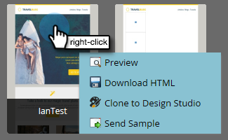

# Présentation du sélecteur de modèles de courriel {#email-template-picker-overview}

Lorsque vous [créez un courrier électronique](../../../../product-docs/email-marketing/general/creating-an-email/create-an-email.md), vous disposez de plusieurs modèles gratuits. Vous pouvez également créer votre propre modèle et l’enregistrer pour une utilisation ultérieure.

**Le** nom sera le nom du courrier électronique que vous créez à partir du modèle et non du modèle lui-même. **La** description s’applique également au courrier électronique et est facultative.

Si votre courrier électronique est essentiel et que vous souhaitez qu’il ne dépasse pas les limites de communication, [le rendre opérationnel](../../../../product-docs/email-marketing/general/functions-in-the-editor/make-an-email-operational.md) en cochant la case. **L’option Ouvrir dans** l’éditeur est sélectionnée par défaut et signifie simplement que vous souhaitez début de modifier immédiatement votre nouveau courrier électronique. **** Créateurs, créez !

**Starter** Templatescomprend une collection de modèles de courrier électronique réactifs prêts à l’emploi. Vous pouvez les utiliser en l&#39;état ou les personnaliser à votre gré.

>[!NOTE]
>
>Les modèles Starter de Marketo sont proposés gratuitement à tous les clients. Bien qu&#39;ils soient continuellement mis à jour et optimisés pour les principaux clients de messagerie (et les périphériques mobiles), vous devez toujours évaluer s&#39;ils répondent à vos besoins. L&#39;[outil de délivrabilité des e-mails](http://docs.marketo.com/display/DOCS/Email+Deliverability+Tool) de Marketo peut vous montrer les rendus de modèles sur différents clients de messagerie. Malheureusement, Marketo ne peut pas traiter de demandes de conception en dehors des engagements de service payant.

**Mes** modèles sont composés de tous les modèles que vous avez créés. Vous pouvez également avoir des dossiers.   

Tous les dossiers qui apparaissent sous Courriels > Modèles dans votre arborescence de Design Studio seront disponibles dans **Mes modèles**.

Pour prévisualisation à un modèle, passez la souris sur sa miniature et cliquez sur **Prévisualisation**. Vous pouvez également cliquer sur le doublon.

L’aperçu vous montre comment le modèle est rendu sur un ordinateur de bureau...

...et un périphérique mobile.

Si vous aimez ce modèle, sélectionnez-le en cliquant sur **Sélectionner** dans le coin inférieur droit. Tu veux continuer à regarder ? Cliquez sur **X** dans l’angle supérieur droit. Utilisez les flèches gauche et droite pour faire défiler les modèles.

Vous pouvez également cliquer avec le bouton droit sur une miniature de modèle pour afficher d’autres options.

>[!NOTE]
>
>Ce qui est sympa avec les miniatures de modèles, c&#39;est qu&#39;elles sont en direct. Si vous apportez une modification à un modèle, la miniature change avec elle.

Assez propre !

>[!MORELIKETHIS]
>
>* [Syntaxe du modèle de courriel](email-template-syntax.md)
>* [Créer un courriel](../../../../product-docs/email-marketing/general/creating-an-email/create-an-email.md)

>

