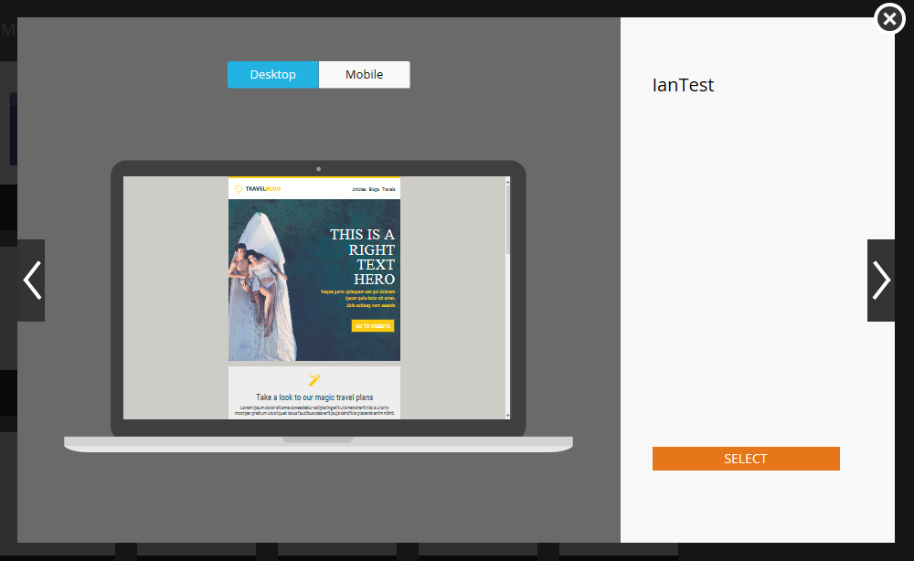

# Aperçu du sélecteur de modèle d’e-mail {#email-template-picker-overview}

Lorsque vous [créez un e-mail](/help/marketo/product-docs/email-marketing/general/creating-an-email/create-an-email.md), vous avez le choix entre plusieurs modèles gratuits. Vous pouvez également créer votre propre modèle et l’enregistrer pour une utilisation ultérieure.

**[!UICONTROL Nom]** sera le nom de l’e-mail que vous créez à partir du modèle, et non le modèle lui-même. **[!UICONTROL Description]** s’applique également à l’e-mail et est facultatif.

Si votre e-mail est critique et que vous souhaitez qu’il contourne les limites de communication, [rendez-le opérationnel](/help/marketo/product-docs/email-marketing/general/functions-in-the-editor/make-an-email-operational.md) en cochant la case. L’option **[!UICONTROL Ouvrir dans l’éditeur]** est sélectionnée par défaut et signifie simplement que vous souhaitez commencer à modifier votre nouvel e-mail immédiatement. **[!UICONTROL Créer]** signifie créer !

**[!UICONTROL Modèles de démarrage]** comprend une collection de modèles d’e-mail réactifs prêts à l’emploi. Vous pouvez les utiliser tels quels ou les personnaliser selon vos besoins.

**[!UICONTROL Mes modèles]** comprend tous les modèles que vous avez créés. Vous pouvez également avoir des dossiers.

Tous les dossiers qui apparaissent sous **[!UICONTROL E-mails]** > **[!UICONTROL Modèles]** dans votre arborescence [!UICONTROL Design Studio] seront disponibles dans **[!UICONTROL Mes modèles]**.

Pour prévisualiser un modèle, pointez sur sa miniature et cliquez sur **[!UICONTROL Aperçu]**. Vous pouvez également simplement double-cliquer dessus.

La prévisualisation vous indique comment le modèle sera rendu sur un ordinateur de bureau...

...et un appareil mobile.

Si vous aimez ce modèle, choisissez-le en cliquant sur **[!UICONTROL Sélectionner]** en bas à droite. Tu veux continuer à chercher ? Cliquez sur le **X** en haut à droite. Utilisez les flèches gauche et droite pour faire défiler les modèles.

Vous pouvez également cliquer avec le bouton droit de la souris sur une miniature de modèle pour accéder à d’autres options.

>[!NOTE]
>
>Ce qui est cool avec les miniatures de modèle, c’est qu’elles sont en ligne. Ainsi, si vous apportez une modification à un modèle, la miniature change en même temps que celui-ci.

Plutôt soigné !

>[!MORELIKETHIS]
>
>* [Syntaxe du modèle d&#39;e-mail](/help/marketo/product-docs/email-marketing/general/email-editor-2/email-template-syntax.md)
>* [Créer un e-mail](/help/marketo/product-docs/email-marketing/general/creating-an-email/create-an-email.md)
