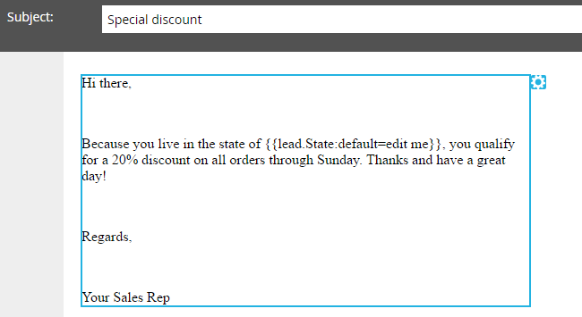

# Ajouter un extrait de code à un courriel {#add-a-snippet-to-an-email}

Les extraits de code sont des blocs réutilisables de texte enrichi et de graphiques que vous pouvez utiliser dans vos courriels et landings page.

>[!PREREQUISITES]
>
>[Création d’un extrait de code](/help/marketo/product-docs/personalization/segmentation-and-snippets/snippets/create-a-snippet.md)

>[!NOTE]
>
>Vous ne pouvez pas incorporer d’extraits de code de [syntaxine](/help/marketo/product-docs/email-marketing/general/email-editor-2/email-template-syntax.md)Marketo par courriel ; cela **ne fonctionnera pas** dans un courriel. Les extraits de code doivent être simplement du contenu du corps (HTML + TEXTE).

1. Recherchez votre adresse électronique, sélectionnez-la et cliquez sur **Modifier le brouillon**.

   

1. Sélectionnez la zone modifiable à convertir en extrait de code, cliquez sur l’icône d’engrenage et sélectionnez **Remplacer par extrait de code**.

   

1. Sélectionnez le fragment de code de votre choix, puis cliquez sur **Enregistrer**.

   

   >[!NOTE]
   >
   >Seuls les fragments approuvés apparaissent dans la liste déroulante.

   

   >[!NOTE]
   >
   >Chaque fois que vous mettez à jour et approuvez votre extrait de code, les modifications sont répercutées dans le courrier électronique. Le courrier électronique sera rédigé à moins que vous n’approuviez le fragment avec [No-Draft](/help/marketo/product-docs/administration/users-and-roles/managing-user-roles-and-permissions/enable-no-draft-for-snippets.md).

Il s’agit d’un moyen simple et rapide de réutiliser le contenu dynamique.
