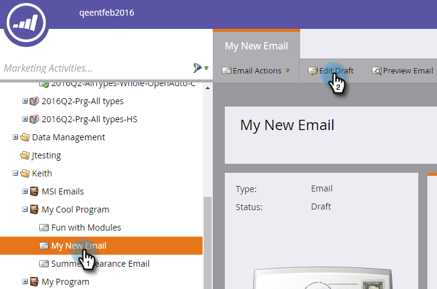

# Ajouter un lien Afficher en tant que page web à un e-mail {#add-a-view-as-web-page-link-to-an-email}

Les fonctionnalités des e-mails sont limitées (CSS limité et pas de JavaScript ni de formulaires). Utilisez Afficher en tant que page web pour fournir un lien afin d’afficher votre e-mail dans un navigateur. Le destinataire utilise alors le cookie [!DNL Munchkin].

>[!NOTE]
>
>* Lors de la création d’un e-mail, Afficher en tant que page web n’est pas activé. Si vous l’activez et clonez l’e-mail, ce paramètre sera copié.
>
>* Les liens « Afficher en tant que page web » expirent au bout de six mois.

1. Sélectionnez votre e-mail et cliquez sur **[!UICONTROL Modifier le brouillon]**.

   

1. Dans l’éditeur d’e-mail, cliquez sur **[!UICONTROL Paramètres de messagerie]**.

   

1. Cochez la case **[!UICONTROL Inclure Afficher en tant que lien de page web]** et cliquez sur **[!UICONTROL Enregistrer]**.

   

Voici un exemple de son apparence :

>[!TIP]
>
>Le lien Afficher en tant que page web n’apparaît que lorsque vous avez envoyé l’e-mail. Envoyez-vous un test à afficher.

Pour modifier le texte par défaut, voir [Modifier le message Afficher en tant que page web »](/help/marketo/product-docs/administration/email-setup/edit-the-view-as-web-page-message.md).
