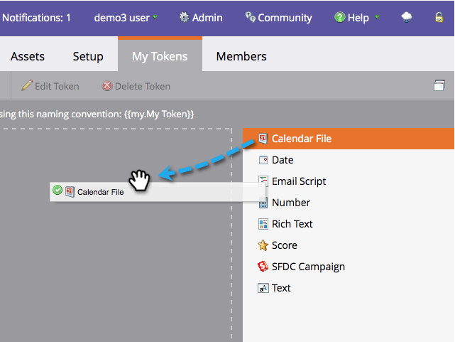

# Créer un fichier d’événement de calendrier (.ics) {#create-a-calendar-event-ics-file}

Un jeton de fichier de calendrier vous permet d’ajouter un lien d’événement de calendrier (.ics) à vos e-mails et landing pages Marketo.

1. Dans votre programme, accédez à l’onglet **[!UICONTROL Mes jetons]**.

   

1. Faites glisser un jeton **[!UICONTROL Fichier de calendrier]** vers la zone de travail.

   

1. Saisissez un **Nom du jeton** puis cliquez sur **[!UICONTROL Cliquer pour modifier]**.

   

1. Saisissez les détails et cliquez sur **[!UICONTROL Enregistrer]**.

   

Mission accomplie ! Veillez à le tester.

>[!MORELIKETHIS]
>
>* [Inclure un événement de calendrier (.ics) dans un e-mail](/help/marketo/product-docs/email-marketing/general/functions-in-the-editor/include-a-calendar-event-ics-in-an-email.md)
>* [Inclure un fichier ICS d&#39;événement de calendrier dans une page de destination](/help/marketo/product-docs/demand-generation/landing-pages/personalizing-landing-pages/include-a-calendar-event-ics-file-in-a-landing-page.md)
