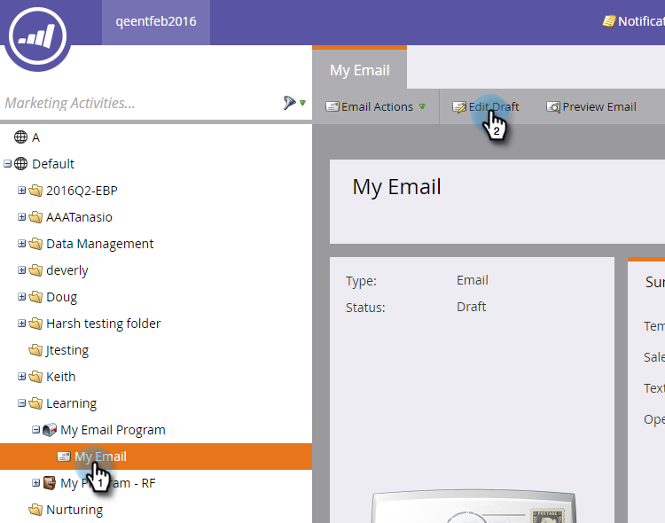
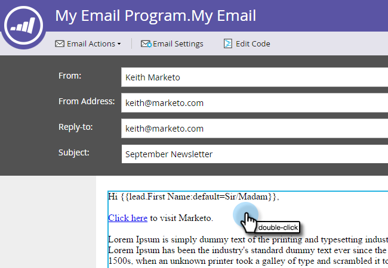
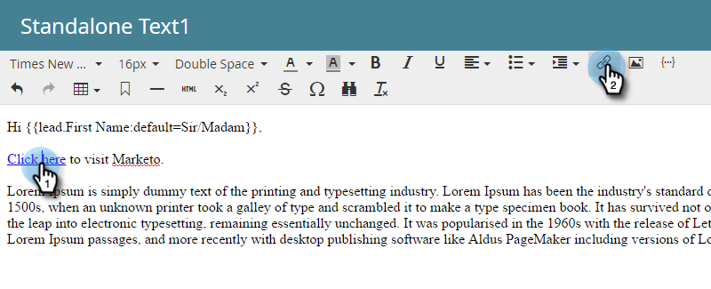
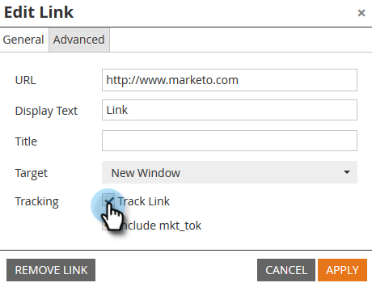
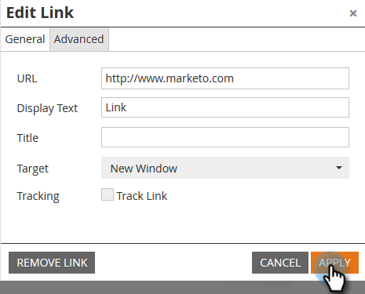
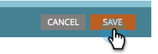

# Désactiver le suivi d’un lien d’e-mail {#disable-tracking-for-an-email-link}

Il arrive que vous ne souhaitiez pas activer l’URL de tracking **** sur un lien dans un e-mail. Cela s’avère utile lorsque la page de destination ne prend pas en charge les paramètres d’URL et peut entraîner la rupture d’un lien.

En outre, si un e-mail a été envoyé il y a plus de 365 jours **et que personne n’a cliqué sur l’un de ses liens au cours des 180 derniers jours** Marketo Engage élague l’itinéraire vers l’URL de notre base de données, ce qui entraîne la rupture du lien. Ainsi, si vous avez besoin que le lien soit permanent, vous devez désactiver le suivi.

1. Sélectionnez votre e-mail et cliquez sur **[!UICONTROL Modifier le brouillon]**.

   

1. Double-cliquez sur la section modifiable contenant le lien.

   

1. Cliquez sur le lien en question, puis sur le bouton **Insérer/Modifier le lien**.

   

1. Dans le pop-up Modifier le lien , décochez la case **[!UICONTROL Suivre le lien]**.

   

1. Vous remarquerez que la zone **[!UICONTROL Inclure mkt_tok]** disparaît. Cliquez sur **[!UICONTROL Appliquer]**.

   

   >[!TIP]
   >
   >En désactivant uniquement la case à cocher **Inclure mkt_tok**, le lien sera toujours suivi, mais après redirection, l’URL de destination n’inclura pas le paramètre de chaîne de requête mkt_tok. Ce paramètre est utilisé par Marketo Landing Pages et Munchkin pour assurer un suivi correct des activités des personnes (comme lorsqu’une personne se désinscrit d’un e-mail). Évitez d’utiliser cette fonctionnalité, sauf si vous constatez un comportement bizarre sur votre site web en raison de la présence du paramètre .

1. Cliquez sur **[!UICONTROL Enregistrer]**

   

   >[!CAUTION]
   >
   >Si vous souhaitez désactiver le suivi des clics pour un lien dans un modèle d’e-mail, ou la [version texte](/help/marketo/product-docs/email-marketing/general/creating-an-email/edit-the-text-version-of-an-email.md){target="_blank"} d’un e-mail, ajoutez l’`mktNoTrack` au *début* de la chaîne, et non à la fin, comme dans cet exemple : `<a class="mktNoTrack" href="https://www.mywebsite.com">This link does not have tracking</a>`. Dans le cas contraire, le lien pourrait disparaître. Si vous avez besoin d’aide pour mettre en œuvre le code ci-dessus, consultez votre développeur web.
