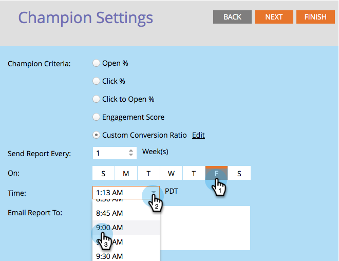
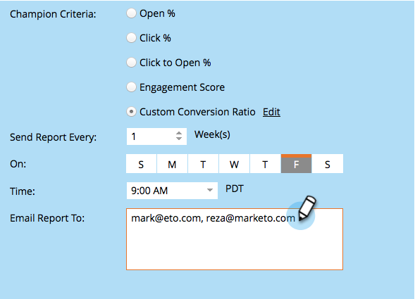

# Champion/Challenger : Analytics {#champion-challenger-analytics}

Recevez des alertes de rapport et/ou consultez le tableau de bord Champion/Challenger pour obtenir des analyses utiles.

>[!PREREQUISITES]
>
>[Champion/Challenger : Définir les critères de champion](/help/marketo/product-docs/email-marketing/general/functions-in-the-editor/email-tests-champion-challenger/champion-challenger-define-champion-criteria.md)

## Configurer des alertes de rapport {#configure-report-alerts}

Marketo vous enverra des rapports sur le déroulement du test de l’email. Voici comment le planifier.

1. Planifions l’envoi du rapport une fois par semaine le vendredi à 9 heures.

   

   >[!TIP]
   >
   >Si vous le souhaitez, vous pouvez sélectionner plusieurs jours de la semaine. Cliquez pour sélectionner, puis cliquez à nouveau pour désélectionner.

1. Saisissez la ou les adresses électroniques auxquelles vous souhaitez envoyer les rapports.

   

1. Cliquez sur **Suivant**.

   

1. Vérifiez que toutes les informations sont correctes, puis cliquez sur **Fermer**.

   

   Le rapport contiendra des détails tels que : type de test, critères de gagnant, nombre d’ouvertures de courrier électronique, etc. Il existe également un lien direct vers le test lui-même, qui vous permet de déclarer le gagnant ! Des trucs sympas.

## Tableau de bord Champion/Challenger {#champion-challenger-dashboard}

Le tableau de bord Champion/Challenger fournit des analyses détaillées sur les performances du contrôle et des variantes dans votre expérimentation Champion/Challenger (ouvertures, clics, pourcentage de désabonnement et autres variables utilisées lors de la configuration du test email). Le tableau de bord fournit également des détails de répartition concernant l’audience ciblée pour diverses variantes d’email, ainsi que la proportion agrégée pour les ouvertures, les clics, le ratio clics/ouvertures et les désabonnements pour toutes les variantes.

