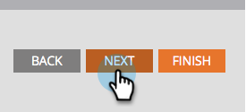

# Champion/Challenger : analyse {#champion-challenger-analytics}

Recevez des alertes de rapports et/ou consultez le tableau de bord Champion/Challenger pour obtenir des analyses utiles.

>[!PREREQUISITES]
>
>[Champion/Challenger : Définir les critères du champion](/help/marketo/product-docs/email-marketing/general/functions-in-the-editor/email-tests-champion-challenger/champion-challenger-define-champion-criteria.md)

## Configuration des alertes de rapport {#configure-report-alerts}

Marketo vous enverra des rapports sur le déroulement du test d’e-mail. Voici comment le planifier.

1. Planifions l&#39;envoi du rapport une fois par semaine le vendredi à 9 h.

   

   >[!TIP]
   >
   >Vous pouvez sélectionner plusieurs jours de la semaine si vous le souhaitez. Cliquez pour sélectionner, cliquez de nouveau pour désélectionner.

1. Saisissez la ou les adresses e-mail auxquelles vous souhaitez que les rapports soient envoyés.

   

1. Cliquez sur **Suivant**.

   

1. Vérifiez que toutes les informations sont correctes et cliquez sur **Fermer**.

   

   Le rapport inclut des détails tels que : type de test, critères de gagnant, nombre d’ouvertures d’e-mail, etc. Il y aura également un lien direct vers le test lui-même, vous permettant de déclarer le gagnant ! Des trucs sympas.

## Tableau de bord Champion/Challenger {#champion-challenger-dashboard}

Le tableau de bord Champion/Challenger fournit des analyses détaillées sur les performances du contrôle et des variantes dans votre expérience Champion/Challenger (ouvertures, clics, pourcentage de désabonnement et autres variables utilisées lors de la configuration du test d&#39;e-mail). Le tableau de bord fournit également des détails de distribution concernant l’audience ciblée pour différentes variantes d’e-mail, ainsi que la proportion agrégée d’ouvertures, de clics, le ratio clics-ouvertures et de désabonnements pour toutes les variantes.

