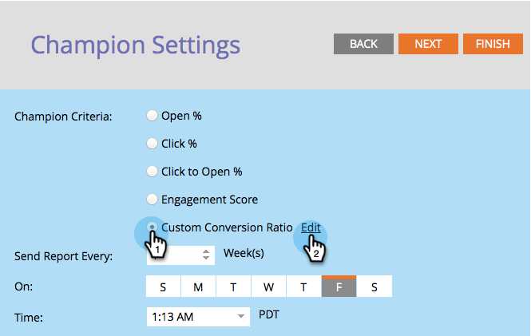

# Champion/Challenger : Définir des critères de champion {#champion-challenger-define-champion-criteria}

Une fois que vous avez configuré votre type de test, vous devez définir les critères de champion. Voici comment.

>[!NOTE]
>
>**Conditions préalables**
>
>* [Ajouter un champion de messagerie/Challenger](add-an-email-champion-challenger.md)

>

## Critères standard de champion {#standard-champion-criteria}

1. Choisissez l&#39;un des critères **** Champion disponibles.

   

   >[!NOTE]
   >
   >Nous suivrons cette mesure et vous enverrons un rapport avec les données par courriel.

1. Si vous avez sélectionné l&#39;un des critères **de** champion par défaut, passez à [Champion/Challenger : Configurer les alertes](champion-challenger-configure-report-alerts.md)de rapport !

## Critères de champion personnalisés {#custom-champion-criteria}

1. Si vous souhaitez obtenir des informations plus sophistiquées, sélectionnez Conversion **** personnalisée et cliquez sur **Modifier**.

   

   >[!NOTE]
   >
   >Cela vous permet de définir n’importe quel événement en tant que conversion à l’aide de déclencheurs et de filtres.

1. Une fenêtre s&#39;affiche : recherchez le déclencheur de votre choix et faites-le glisser dans la trame.

   

1. Définissez le déclencheur.

   

   Marketo n’autorise que les déclencheurs pour les personnes qui ont reçu le courrier électronique à partir de ce programme électronique. Il n’est pas nécessaire d’ajouter un filtre &quot;Courrier électronique envoyé&quot;.

1. Cliquez sur **Fermer**.

   

   Super ! Il est maintenant temps de planifier le rapport.

   >[!NOTE]
   >
   >**Articles connexes**
   >
   >    
   >    
   >    * [Champion/Challenger : Configuration des alertes de rapport](champion-challenger-configure-report-alerts.md)

