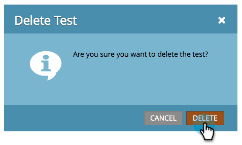

# Champion/Challenger : Ignorer un test de courriel {#champion-challenger-discard-an-email-test}

Si, à un moment ou à un autre, vous décidez de ne pas continuer à exécuter votre test par courrier électronique, vous pouvez l’ignorer. Voici comment.

>[!PREREQUISITES]
>
>[Champion/Challenger : Approuver votre test de messagerie](/help/marketo/product-docs/email-marketing/general/functions-in-the-editor/email-tests-champion-challenger/champion-challenger-approve-your-email-test.md)

1. Accédez à **Activités marketing**.

   

1. Recherchez et cliquez avec le bouton droit sur votre test de messagerie, puis cliquez sur **Ignorer le test**.

   

1. Cliquez sur **Supprimer** pour confirmer.

   

   Vous avez fini ! Si vous décidez de reconfigurer un test, allez-y et [ajoutez un champion/challenger ](/help/marketo/product-docs/email-marketing/general/functions-in-the-editor/email-tests-champion-challenger/add-an-email-champion-challenger.md) par courriel.
