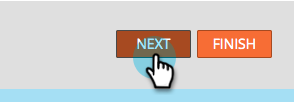

# Champion/Challenger : De L&#39;Adresse {#champion-challenger-from-address}

Vous souhaitez essayer une adresse de type &quot;De&quot; différente sans problème ? Voici comment.

>[!PREREQUISITES]
>
>[Ajouter un champion de messagerie/Challenger](/help/marketo/product-docs/email-marketing/general/functions-in-the-editor/email-tests-champion-challenger/add-an-email-champion-challenger.md)

1. Dans l’éditeur de test d’email, sélectionnez **Adresse de l’expéditeur** dans la liste déroulante **Type de test** .

   

   >[!NOTE]
   >
   >La première adresse de départ est désignée comme **championne**. Les adresses suivantes sont appelées **Challengers**.

1. Saisissez les **Du nom** (à gauche) et **De l’adresse** (à droite) pour les challengers.

   

   >[!TIP]
   >
   >Si vous souhaitez plusieurs challenger, cliquez sur le signe plus et saisissez un autre nom et un autre email.

1. Faites glisser le curseur pour décider du pourcentage de partage entre les personnes qui reçoivent des emails avec le champion de l’adresse et celles qui reçoivent des emails avec le challenger de l’adresse de l’expéditeur.

   

   >[!NOTE]
   >
   >**Exemple**
   >
   >Dans la distribution illustrée ci-dessus, 15 % de l’audience totale spécifiée dans la liste dynamique reçoit l’un des emails avec un challenger From Address et 85 % reçoivent le courriel avec le champion From Address. Les courriers électroniques pour plusieurs concurrents des adresses partagent les 15 % de parts. Lorsque le test est terminé, vous pouvez désigner un gagnant manuellement. À partir de ce moment, toutes les futures personnes recevront le contenu le plus performant. Dans les campagnes de déclenchement, le pourcentage réalisé peut différer du pourcentage sélectionné, car la distribution peut ne pas correspondre exactement aux pourcentages choisis. Cela peut se produire lorsqu&#39;une variante traite un nombre important de personnes désinscrites ou lorsqu&#39;une variante est un email opérationnel alors que les autres ne le sont pas.

   Pour obtenir une fiabilité statistique, veillez à choisir un pourcentage qui inclut suffisamment de personnes pour que votre test soit valide. Ne vous laissez pas berner par des résultats peu concluants.

1. Cliquez sur **Suivant**.

   

   Progression ! Continuons !

   >[!MORELIKETHIS]
   >
   >[Champion/Challenger : Définir les critères de champion](/help/marketo/product-docs/email-marketing/general/functions-in-the-editor/email-tests-champion-challenger/champion-challenger-define-champion-criteria.md)
