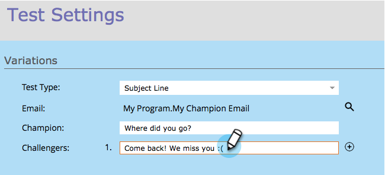

# Champion/Challenger : Objet {#champion-challenger-subject-line}

Vous pouvez facilement tester plusieurs lignes d’objet. Lorsque le test est terminé, envoyez des courriels avec le plus efficace. Voici comment le faire.

>[!PREREQUISITES]
>
>* [Ajouter un champion de messagerie/Challenger](add-an-email-champion-challenger.md)

>

1. Dans l’éditeur de test par courrier électronique, sélectionnez **Objet** dans la liste déroulante **Type de test **.

   

   >[!NOTE]
   >
   >Dans un test de sujet, la première ligne de sujet entrée est désignée comme **Champion**. Les lignes suivantes sont appelées **Challengers**.

1. Entrez le(s) sujet(s) pour les **Challengers**.

   

   >[!TIP]
   >
   >Si vous souhaitez plusieurs challenger, cliquez sur le signe plus et saisissez une autre ligne d’objet.

1. Faites glisser le curseur pour déterminer le pourcentage de répartition entre les personnes qui reçoivent la ou les lignes de sujet du champion et celles du challenger.

   

   >[!NOTE]
   >
   >**Exemple**
   >
   >
   >Dans la distribution illustrée ci-dessus, 10 % de l&#39;audience totale spécifiée dans la liste intelligente reçoit l&#39;un des courriels avec l&#39;objet challenger et 90 % reçoivent des courriels avec l&#39;objet champion. Les courriels comportant plusieurs objets challenger partagent les 10 % de parts de trafic. Lorsque le test est terminé, vous pouvez déclarer manuellement un gagnant. A partir de ce moment, tous les futurs utilisateurs recevront le contenu le plus performant.

   Pour obtenir une confiance statistique, assurez-vous que le pourcentage choisi inclut suffisamment de personnes, de sorte que votre test soit valide. Ne vous laissez pas berner par des résultats peu concluants.  [Plus d&#39;informations que jamais sur la fiabilité](http://en.wikipedia.org/wiki/Confidence_interval) statistique.

1. Cliquez sur **Suivant**.

   

   Progrès ! Continuons.

   >[!MORELIKETHIS]
   >
   >
   >
   >[Champion/Challenger : Définir des critères de champion](champion-challenger-define-champion-criteria.md)

