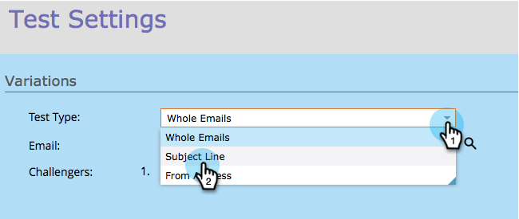
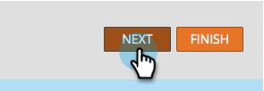

# Champion/Challenger : Objet {#champion-challenger-subject-line}

Vous pouvez facilement tester plusieurs objets. Lorsque le test est terminé, envoyez des emails avec le plus efficace. Voici comment le faire.

>[!PREREQUISITES]
>
>[Ajouter un champion de messagerie/Challenger](/help/marketo/product-docs/email-marketing/general/functions-in-the-editor/email-tests-champion-challenger/add-an-email-champion-challenger.md)

1. Dans l’éditeur de test d’email, sélectionnez **Objet** dans la liste déroulante **Type de test**.

   

   >[!NOTE]
   >
   >Dans un test d’objet, la première ligne d’objet entrée est désignée comme **Champion**. Les lignes d’objet suivantes sont appelées **Challengers**.

1. Saisissez l’objet pour le **Challengers**.

   

   >[!TIP]
   >
   >Si vous souhaitez plusieurs concurrents, cliquez sur le signe plus et saisissez un autre objet.

1. Faites glisser le curseur pour choisir le pourcentage de répartition entre les personnes qui reçoivent l’objet du champion et la ou les lignes de l’objet du challenger.

   

   >[!NOTE]
   >
   >**Exemple**
   >
   >Dans la distribution illustrée ci-dessus, 10 % de l’audience totale spécifiée dans la liste dynamique reçoit l’un des emails avec l’objet challenger et 90 % des emails avec l’objet champion. Les emails avec plusieurs objets challenger partagent les 10 % de partage égal. Lorsque le test est terminé, vous pouvez désigner un gagnant manuellement. À partir de ce moment, toutes les futures personnes recevront le contenu le plus performant. Dans les campagnes de déclenchement, le pourcentage réalisé peut différer du pourcentage sélectionné, car la distribution peut ne pas correspondre exactement aux pourcentages choisis. Cela peut se produire lorsqu&#39;une variante traite un nombre important de personnes désinscrites ou lorsqu&#39;une variante est un email opérationnel alors que les autres ne le sont pas.

   Pour obtenir une fiabilité statistique, assurez-vous que le pourcentage choisi inclut suffisamment de personnes, afin que votre test soit valide. Ne vous laissez pas berner par des résultats peu concluants.

1. Cliquez sur **Suivant**.

   

   Progression ! Continuons !

   >[!MORELIKETHIS]
   >
   >[Champion/Challenger : Définir les critères de champion](/help/marketo/product-docs/email-marketing/general/functions-in-the-editor/email-tests-champion-challenger/champion-challenger-define-champion-criteria.md)
