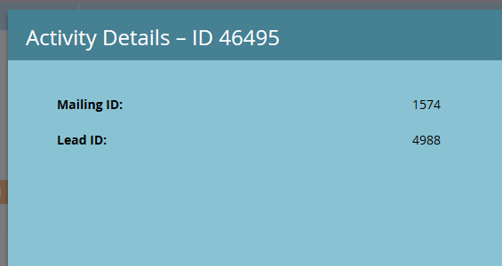
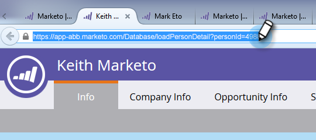

# Transférer à un lien d&#39;ami dans les courriels {#forward-to-a-friend-link-in-emails}

Ajouter le lien &quot;Transférer à un ami&quot; à vos courriels vous permet de suivre les personnes qui ont reçu un courriel transféré par ce lien et de les ajouter automatiquement en tant que nouvelle personne si elles ne sont pas déjà dans la base de données.

Par exemple, supposons que Keith utilise le lien &quot;Transférer à un ami&quot; pour transférer le courriel à une personne inconnue, Mark. Mark est automatiquement ajouté en tant que nouvelle personne, se voit attribuer son propre cookie, et toute de ses e-mails et activités web est liée à lui. Cependant, si Keith utilise le bouton Avance dans son client de messagerie, Mark reçoit un cookie incorrect en tant que Keith et son activité est enregistrée en tant que Keith.

## Ajouter le lien vers un modèle de courriel {#add-the-link-to-an-email-template}

1. Accédez à **Design Studio**.

   

1. Recherchez et sélectionnez le modèle de courrier électronique auquel vous souhaitez ajouter le lien. Cliquez sur **Modifier le brouillon**.

   

1. Collez le code HTML suivant dans lequel vous souhaitez que le lien &quot;Transférer vers l’ami&quot; s’affiche (si vous avez besoin d’aide pour cette partie, contactez votre développeur Web) :

   `<pre data-theme="Confluence"><a href="{{system.forwardToFriendLink}}">Forward to Friend</a></pre>`

   

   >[!TIP]
   >
   >
   >Vous pouvez ajouter un style au lien pour lui donner une apparence plus agréable. Par exemple :
   >
   >`<a href="{{system.forwardToFriendLink}}" style="font-family:arial, sans-serif; padding:10px; position:absolute; right:0px;">Forward to Friend</a>`

   >[!CAUTION]
   >
   >Il est déconseillé d’utiliser le style **position:relative** dans votre modèle de courrier électronique. Il peut créer des problèmes avec la position et l&#39;affichage de la case &quot;Transférer à l&#39;ami&quot;.

1. Cliquez sur **Version préliminaire de la Prévisualisation** pour vous assurer que le modèle ressemble à ce que vous souhaitez.

   

   >[!NOTE]
   >
   >Pensez à approuver le modèle de brouillon pour appliquer les modifications.

   Désormais, tous les courriels qui utilisent ce modèle auront le lien &quot;Transférer vers un ami&quot;. Lorsque le destinataire de messagerie clique dessus, il est dirigé vers une version Web du courrier électronique à l’aide de la case &quot;Transférer à un ami&quot; :

   

## Ajouter le lien vers un courriel individuel {#add-the-link-to-an-individual-email}

Vous pouvez également ajouter le lien &quot;Transférer à l&#39;ami&quot; directement dans un courriel.

1. Ouvrez le courrier électronique dans lequel vous souhaitez inclure le lien, puis cliquez en doublon dans la zone modifiable.

   

1. Placez le curseur à l’endroit où vous souhaitez que le lien s’affiche et cliquez sur le bouton **Insérer un jeton**.

   

1. Sélectionnez le jeton **`{{system.forwardToFriendLink}}`**.

   

   >[!NOTE]
   >
   >Ce jeton est l’URL de la version Web du courriel avec une zone &quot;Transférer à l’ami&quot;.

1. Écrivez ce que vous voulez que le texte d&#39;affichage du lien soit (par exemple, &quot;Transférer à un ami&quot;).

   

1. Coupez le jeton **`{{system.forwardToFriendLink}}`** en utilisant Ctrl+X (Windows) ou Cmd+X (Mac). Sélectionnez &quot;Transférer à un ami&quot; et cliquez sur le bouton **Insérer/Modifier le lien**.

   

1. Collez le jeton **`{{system.forwardToFriendLink}}`** dans la zone **URL** à l’aide de Ctrl/Cmd+V, puis cliquez sur **Insérer**.

   

1. Enregistrez la modification et prévisualisation de votre nouveau lien !

   

   >[!NOTE]
   >
   >Les nouvelles personnes qui reçoivent un e-mail &quot;Transférer à un ami&quot; sont par défaut désabonnées aux e-mails marketing.

## Activité de transfert de vue {#view-forwarding-activity}

Vous pouvez voir qui a transféré et reçu les courriels dans le journal d&#39;Activité de la personne.

1. Accédez au **`Database`**.

   

1. Doublon-cliquez sur la personne pour laquelle vous souhaitez vue l&#39;activité.

   

1. Accédez à l&#39;onglet **Journal des Activités**. Doublon-clic **Received Forward to Friend Email** or **Sent Forward to Friend Email** pour afficher les détails.

   

   >[!NOTE]
   >
   >**Définition**
   >
   >Dans le cas d’un courrier électronique envoyé à un ami, l’ID de personne est la personne qui a envoyé le courrier électronique.
   >
   >Dans le cas d’un courriel envoyé à un ami, l’ID de personne est la personne qui a reçu le courriel.

   

1. Pour vue d’une personne par identifiant, copiez et collez l’**identifiant de personne** à la fin de l’URL (le début de cette URL dépend de votre instance de marché) :

   `<pre data-theme="Confluence">...marketo.com/Database/loadPersonDetail?personId=</pre>`

   >[!NOTE]
   >
   >Nous rendrons l&#39;**ID de personne** cliquable et créerons un lien direct vers la personne dans un correctif à venir.

   

   >[!NOTE]
   >
   >Si l’ami recevant l’avance est une personne inconnue, une nouvelle personne est créée avec &quot;Transférer à l’ami&quot; marqué comme **Source** de la personne.
   >Si le courrier électronique est un actif local d’un programme, le programme est marqué comme **Programme d’acquisition** de la personne.

## Déclencher ou filtrer à l’aide de l’Activité de transfert {#trigger-or-filter-using-forwarding-activity}

Il existe six déclencheurs/filtres que vous pouvez utiliser pour déclencher des actions de flux ou filtrer les personnes en envoyant et en recevant une activité &quot;Transférer à l&#39;ami&quot;.

Dans la liste intelligente d’une campagne intelligente, si vous recherchez &quot;avant&quot;, vous trouverez les déclencheurs et les filtres disponibles.

## Tester vers l&#39;ami {#test-forward-to-friend}

Pour tester &quot;Transférer à un ami&quot;, envoyez-vous un courriel contenant le lien &quot;Transférer à un ami&quot;. Assurez-vous de l’envoyer par l’étape de flux **Envoyer un courriel**, *pas* par **Envoyer un courriel de test**.
