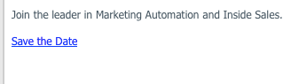

# Inclure un Événement de calendrier (.ics) dans un courriel {#include-a-calendar-event-ics-in-an-email}

Un jeton Fichier de calendrier vous permet d’ajouter un lien de événement de calendrier (.ics) à vos courriels de marketing.

>[!PREREQUISITES]
>
>[Créer un fichier de Événement de calendrier (.ics)](/help/marketo/product-docs/email-marketing/general/functions-in-the-editor/create-a-calendar-event-ics-file.md)

1. Lors de la modification du courrier électronique de votre programme, cliquez à l’endroit où vous souhaitez placer le jeton, puis cliquez sur le bouton Insérer un jeton.

1. Sélectionnez le jeton Fichier de calendrier et cliquez sur **Insérer**.

   

1. Cliquez sur **Enregistrer**.

   

   Vos destinataires recevront un courriel qui ressemble à ceci.

   

Mission accomplie !
