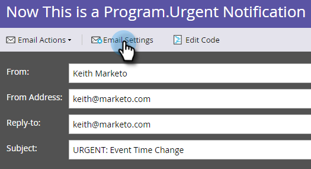

# Rendre un e-mail opérationnel {#make-an-email-operational}

Les e-mails opérationnels ignorent les statuts Désabonné et Marketing suspendu . Ils ne sont pas non plus soumis à des limites de communication. Ils envoient quoi qu&#39;il arrive.

>[!NOTE]
>
>Les e-mails opérationnels ne sont pas comptabilisés dans les limites de communication. Par exemple, si une personne ne peut recevoir qu’un seul e-mail par semaine et que vous lui avez déjà envoyé un e-mail marketing, vous pouvez toujours lui envoyer un e-mail opérationnel si nécessaire.

1. Recherchez votre e-mail, sélectionnez-le et cliquez sur **[!UICONTROL Modifier le brouillon]**.

>[!NOTE]
>
>Vous ne devez utiliser les e-mails opérationnels que pour les e-mails critiques et les répondeurs automatiques. Ils ne sont pas destinés aux e-mails marketing.

1. Une fois l’éditeur ouvert, cliquez sur **[!UICONTROL Paramètres d’e-mail]**.

   

1. Cochez la case **[!UICONTROL E-mail opérationnel]** et cliquez sur **[!UICONTROL Enregistrer]**.

   

>[!CAUTION]
>
>Les e-mails opérationnels n’ont pas été conçus pour fonctionner avec les programmes d’engagement. Par conséquent, un programme d’engagement ignore le statut opérationnel d’un e-mail. Gardez cela à l’esprit lorsque vous travaillez avec eux.

N&#39;oubliez pas d&#39;approuver cet e-mail pour que les modifications soient prises en compte. Découvrez comment [approuver un e-mail](/help/marketo/product-docs/email-marketing/general/creating-an-email/approve-an-email.md).
