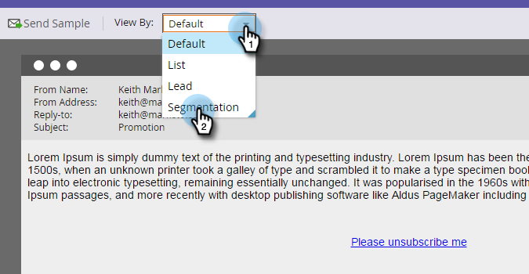
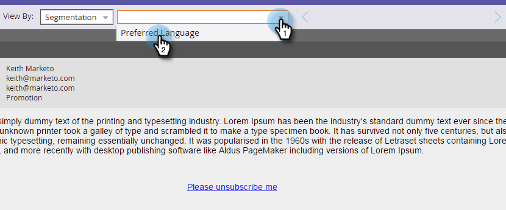
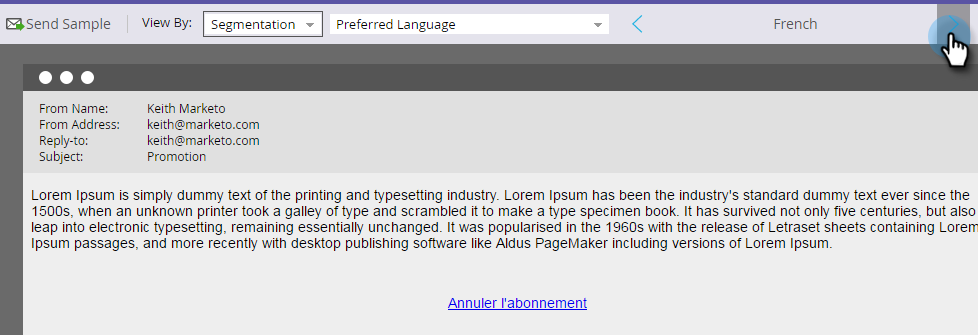
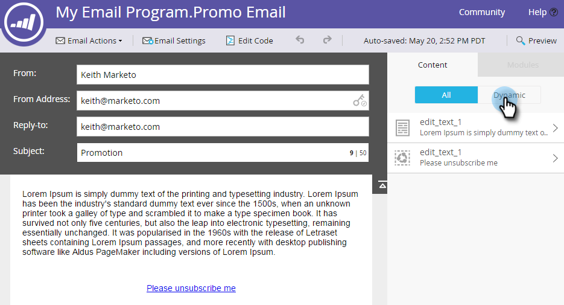

# Prévisualisation d’un courrier électronique avec du contenu dynamique {#preview-an-email-with-dynamic-content}

Prévisualisation de votre courrier électronique après l’ajout d’un contenu dynamique afin de le vérifier.

1. Sélectionnez votre adresse électronique, puis cliquez sur **Prévisualisation électronique**.

   

   Cliquez sur la liste déroulante Vue par et sélectionnez le type de contenu dynamique à prévisualisation.
   

1. Une nouvelle liste déroulante s’affiche. Cliquez dessus et choisissez le contenu spécifique.

   

1. Utilisez les flèches pour faire défiler les options.

   

Vous pouvez également prévisualisation du contenu dynamique directement dans l’éditeur de courrier électronique.

1. Sous **Contenu**, cliquez sur l’onglet **Dynamique** .

   

1. Cliquez sur le contenu que vous souhaitez prévisualisation.

   

Super ! Prévisualisation de vos courriels pour vous assurer que le contenu correspond à vos besoins.
