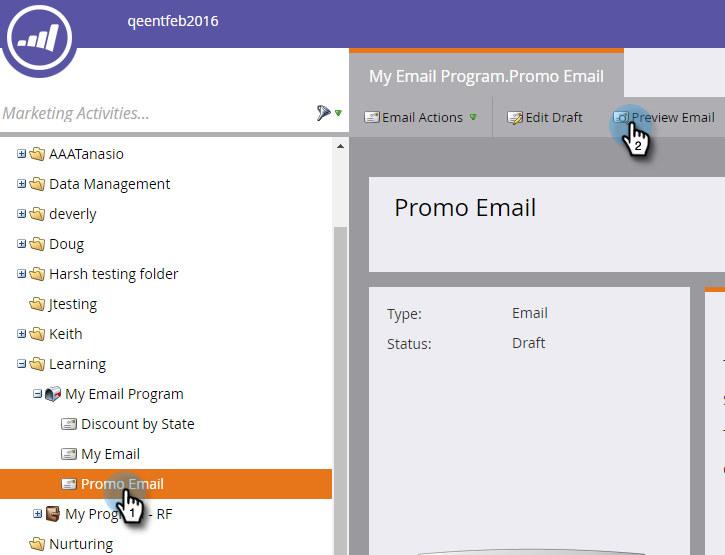

# Prévisualiser un e-mail avec du contenu dynamique {#preview-an-email-with-dynamic-content}

Prévisualisez votre e-mail après l’ajout de contenu dynamique afin de le vérifier.

1. Sélectionnez votre e-mail et cliquez sur **[!UICONTROL Prévisualiser l’e-mail]**.

   

1. Cliquez sur le menu déroulant **[!UICONTROL Afficher par]** et sélectionnez le type de contenu dynamique à prévisualiser.

   

1. Une nouvelle liste déroulante s’affiche. Cliquez dessus et sélectionnez le contenu spécifique.

   

1. Utilisez les flèches pour faire défiler les options.

   

Vous pouvez également prévisualiser le contenu dynamique directement dans l’éditeur d’e-mail.

1. Sous **[!UICONTROL Contenu]**, cliquez sur l’onglet **[!UICONTROL Dynamique]**.

   

1. Cliquez sur le contenu à prévisualiser.

   

Fantastique ! Prévisualisez vos e-mails pour vous assurer que le contenu est celui que vous souhaitez.
