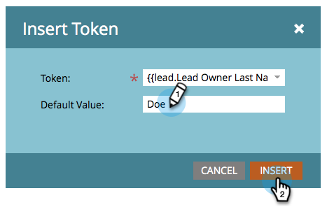

# Envoyer des e-mails depuis l’entité propriétaire du lead {#send-emails-from-the-lead-owner}

Que se passe-t-il si vous souhaitez envoyer un e-mail à un prospect au nom du propriétaire du prospect ?  Voici comment faire.

1. Recherchez votre e-mail, sélectionnez-le et cliquez sur **[!UICONTROL Modifier le brouillon]**.

   

1. Cliquez dans le champ **[!UICONTROL De]** (supprimez tout nom existant), puis cliquez sur le bouton **Insérer un jeton**.

   

1. Commencez à saisir « `{{lead.Lead Owner` » et sélectionnez le jeton **`{{lead.Lead Owner First Name}}`**.

   

1. Saisissez une valeur par défaut au cas où le prospect n’a pas encore de propriétaire, puis cliquez sur **[!UICONTROL Insérer]**.

   

1. Cliquez après le premier jeton, ajoutez un espace, puis cliquez sur le bouton **Insérer un jeton**.

   

1. Commencez à saisir « `{{lead.Lead Owner` » et sélectionnez le jeton **`{{lead.Lead Owner Last Name}}`**.

   

1. Saisissez une valeur par défaut au cas où le prospect n’a pas encore de propriétaire, puis cliquez sur **[!UICONTROL Insérer]**.

   

   >[!TIP]
   >
   >Veillez à ajouter un espace entre les jetons de prénom et de nom.

1. Cliquez dans le champ **[!UICONTROL Adresse de l’expéditeur]** (supprimez toute adresse e-mail existante), puis cliquez sur le bouton **Insérer un jeton**.

   

1. Commencez à saisir « `{{lead.Lead Owner` » et sélectionnez le jeton **`{{lead.Lead Owner Email Address}}`**.

   

1. Saisissez une valeur par défaut au cas où le prospect n’a pas encore de propriétaire, puis cliquez sur **[!UICONTROL Insérer]**.

   

1. Assurez-vous que les champs **[!UICONTROL Répondre à]** et **[!UICONTROL Objet]** sont renseignés, et vous avez terminé !

   
