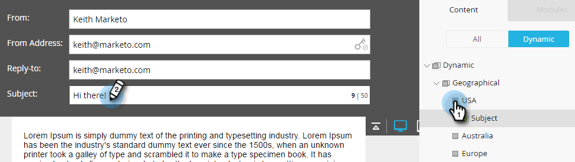

# Utilisation de contenu dynamique dans un courrier électronique {#using-dynamic-content-in-an-email}

>[!PREREQUISITES]
>
>* [Création d’une segmentation](../../../../product-docs/personalization/segmentation-and-snippets/segmentation/create-a-segmentation.md)

>

Utilisez Contenu dynamique dans les courriers électroniques pour envoyer les informations ciblées de pistes.

## Segmentation des Ajoutes {#add-segmentation}

1. Accédez à Activités marketing.

   

1. Sélectionnez votre adresse électronique, puis cliquez sur Modifier le brouillon.

   

1. Dans cet exemple, nous rendons la ligne de sujet dynamique. Cliquez dans le champ Objet, puis sur le bouton **Rendre dynamique**.

   

   >[!NOTE]
   >
   >Vous pouvez également créer un élément dans la dynamique du courrier électronique. Pour ce faire, sélectionnez la zone, cliquez sur l’icône d’engrenage, puis sélectionnez **Rendre dynamique** (ou [Remplacer par un extrait de code](../../../../product-docs/personalization/segmentation-and-snippets/snippets/create-a-snippet.md), selon ce que vous faites).

   Saisissez le nom de la segmentation, sélectionnez-le, puis cliquez sur Enregistrer.

   

   Votre segmentation et ses segments s’affichent sous l’onglet Dynamique à droite.

   

## Appliquer du contenu dynamique {#apply-dynamic-content}

>[!CAUTION]
>
>Le nombre d’éléments de contenu dynamique autorisés n’est pas illimité. Bien qu’il n’existe aucune limite de nombre spécifique (elle peut varier en fonction de la combinaison de contenu), l’utilisation abusive de contenu dynamique peut avoir une incidence négative sur les performances du courrier électronique. Il est recommandé de conserver la quantité d’éléments de contenu dynamique utilisée jusqu’à moins de 20 par courriel.

1. Cliquez sur vos segments et ajoutez votre objet.

1. Répétez cette opération pour chaque segment.

   

>[!TIP]
>
>Créez un message électronique par défaut avant d’appliquer le contenu aux différents segments.

>[!CAUTION]
>
>Les modifications apportées au bloc de contenu de segment par défaut sont appliquées à tous les segments.

Doux ! Vous pouvez désormais envoyer des courriers électroniques flexibles à votre audience de cible.

>[!NOTE]
>
>**Articles connexes**
>
>* [Prévisualisation d’un courrier électronique avec du contenu dynamique](preview-an-email-with-dynamic-content.md)
>* [Utilisation du contenu dynamique dans un Landing page](../../../../product-docs/demand-generation/landing-pages/free-form-landing-pages/use-dynamic-content-in-a-free-form-landing-page.md)

>

