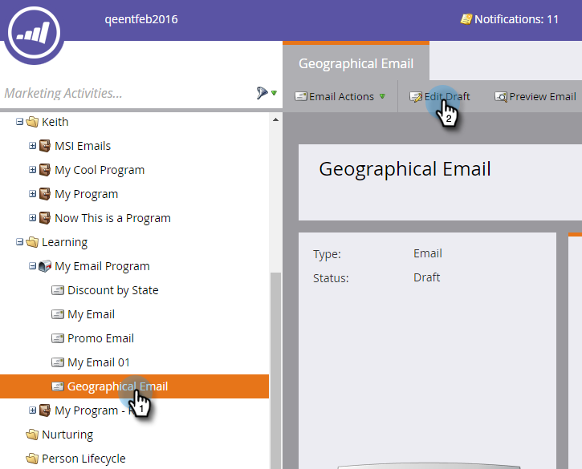
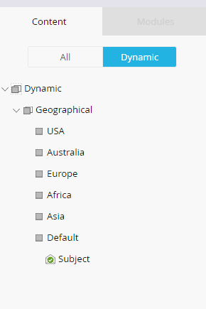

# Utilisation du contenu dynamique dans un e-mail {#using-dynamic-content-in-an-email}

>[!PREREQUISITES]
>
>[Créer une segmentation](/help/marketo/product-docs/personalization/segmentation-and-snippets/segmentation/create-a-segmentation.md)

Utilisez le contenu dynamique dans les e-mails pour envoyer les informations ciblées de vos prospects.

>[!NOTE]
>
>L’utilisation de variables dans le contenu dynamique d’un e-mail n’est prise en charge que lors de l’utilisation de campagnes Trigger. Elle n’est **pas** prise en charge lors de l’utilisation de campagnes par lots.

## Ajouter une segmentation {#add-segmentation}

1. Accédez à **[!UICONTROL Activités marketing]**.

   

1. Sélectionnez votre e-mail et cliquez sur **[!UICONTROL Modifier le brouillon]**.

   

1. Dans cet exemple, nous rendons la ligne d&#39;objet dynamique. Cliquez dans le champ [!UICONTROL Objet], puis sur le bouton **Rendre dynamique**.

   

   >[!NOTE]
   >
   >Vous pouvez également rendre dynamique un élément dans l’e-mail. Pour ce faire, sélectionnez la zone, cliquez sur l’icône d’engrenage, puis sélectionnez **Rendre dynamique** (ou [Remplacer par un fragment de code](/help/marketo/product-docs/personalization/segmentation-and-snippets/snippets/create-a-snippet.md), selon ce que vous faites).

1. Saisissez le nom de la segmentation, sélectionnez-le, puis cliquez sur **[!UICONTROL Enregistrer]**.

   

   Votre segmentation et ses segments apparaissent sous l’onglet [!UICONTROL Dynamique] à droite.

   

## Application de contenu dynamique {#apply-dynamic-content}

>[!CAUTION]
>
>Le nombre d’éléments de contenu dynamique autorisés n’est pas illimité. Bien qu’il n’y ait pas de limite de nombre spécifique (elle peut varier en fonction de la combinaison de contenu), la surutilisation de contenu dynamique peut avoir une incidence négative sur les performances de l’e-mail. Nous vous recommandons de maintenir la quantité d’éléments de contenu dynamique utilisés à moins de 20 par e-mail.

1. Cliquez sur vos segments et ajoutez votre ligne d’objet.

1. Répétez l’opération pour chaque segment.

   

>[!TIP]
>
>Créez un e-mail par défaut avant d’appliquer du contenu aux différents segments.

>[!CAUTION]
>
>Les modifications apportées au bloc de contenu de segment par défaut sont appliquées à tous les segments.

Doux ! Vous pouvez désormais envoyer des e-mails flexibles à votre audience cible.

>[!MORELIKETHIS]
>
>* [Prévisualiser un e-mail avec du contenu dynamique](/help/marketo/product-docs/email-marketing/general/functions-in-the-editor/preview-an-email-with-dynamic-content.md)
>* [Utilisation de contenu dynamique dans une page de destination](/help/marketo/product-docs/demand-generation/landing-pages/free-form-landing-pages/use-dynamic-content-in-a-free-form-landing-page.md)
