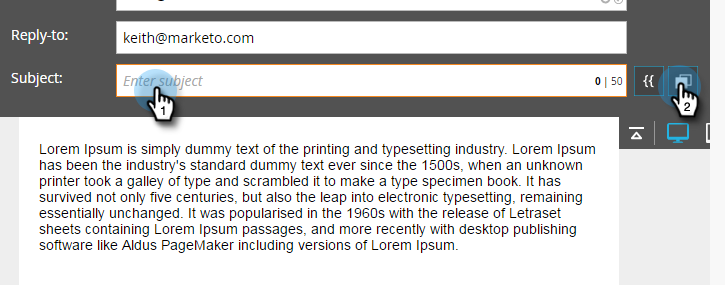

# Utilisation de contenu dynamique dans un email {#using-dynamic-content-in-an-email}

>[!PREREQUISITES]
>
>[Créer une segmentation](/help/marketo/product-docs/personalization/segmentation-and-snippets/segmentation/create-a-segmentation.md)

Utilisez Contenu dynamique dans les emails pour envoyer les informations ciblées de prospects.

>[!NOTE]
>
>L&#39;utilisation de variables dans le contenu dynamique d&#39;un email n&#39;est prise en charge que lors de l&#39;utilisation des campagnes de déclenchement. Il n’est **pas** pris en charge lors de l’utilisation de campagnes par lots.

## Ajouter une segmentation {#add-segmentation}

1. Accédez à **Activités marketing**.

   

1. Sélectionnez votre adresse électronique et cliquez sur **Modifier le brouillon**.

   

1. Dans cet exemple, nous rendons l&#39;objet dynamique. Cliquez dans le champ Objet , puis cliquez sur le bouton **Rendre dynamique** .

   

   >[!NOTE]
   >
   >Vous pouvez également créer un élément dans la dynamique de l&#39;email. Pour ce faire, sélectionnez la zone, cliquez sur l’icône d’engrenage, puis sélectionnez **Rendre dynamique** (ou [Remplacer par un extrait de code](/help/marketo/product-docs/personalization/segmentation-and-snippets/snippets/create-a-snippet.md), selon ce que vous faites).

1. Saisissez le nom de la segmentation, sélectionnez-le, puis cliquez sur **Enregistrer**.

   

   Votre segmentation et ses segments apparaissent sous l’onglet Dynamique à droite.

   

## Appliquer du contenu dynamique {#apply-dynamic-content}

>[!CAUTION]
>
>Le nombre d’éléments de contenu dynamique autorisé est illimité. Bien qu’il n’existe aucune limite de nombre spécifique (elle peut varier en fonction de la combinaison de contenu), l’utilisation excessive de contenu dynamique peut avoir une incidence négative sur les performances de l’email. Nous vous recommandons de conserver la quantité d’éléments de contenu dynamique utilisée pour moins de 20 par email.

1. Cliquez sur vos segments et ajoutez votre objet.

1. Répétez l’opération pour chaque segment.

   

>[!TIP]
>
>Créez un email par défaut avant d&#39;appliquer le contenu aux différents segments.

>[!CAUTION]
>
>Les modifications apportées au bloc de contenu Segment par défaut sont appliquées à tous les segments.

Doux ! Vous pouvez désormais envoyer des emails flexibles à votre audience cible.

>[!MORELIKETHIS]
>
>* [Aperçu d’un email avec du contenu dynamique](/help/marketo/product-docs/email-marketing/general/functions-in-the-editor/preview-an-email-with-dynamic-content.md)
>* [Utiliser du contenu dynamique dans une page d’entrée](/help/marketo/product-docs/demand-generation/landing-pages/free-form-landing-pages/use-dynamic-content-in-a-free-form-landing-page.md)
