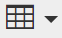
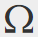

# Utilisation de l’éditeur de texte enrichi {#using-the-rich-text-editor}

L’éditeur de texte enrichi (RTE) s’affiche dans tout Marketo et est disponible lorsque vous souhaitez ajouter ou modifier du contenu. Une version apparaît sur les landing pages, les programmes, les emails, les formulaires et les fragments de code. Cliquez simplement sur **Modifier le brouillon** et il s’affiche pour vous servir.

## Paramètres de l’éditeur {#editor-settings}

Le paramètre d’élément de bloc racine définit les balises qui encapsulent votre contenu. Par défaut, l’élément de bloc racine d’email utilise des balises `
`. Vous avez la possibilité de modifier ce paramètre en suivant les étapes ci-dessous.

>[!TIP]
>
>Bien que vous ayez la possibilité de choisir votre élément de bloc racine, nous vous recommandons toujours d’utiliser les paramètres par défaut pour optimiser l’expérience utilisateur.

1. Cliquez sur **Admin**.

   

1. Cliquez sur **Email**.

   

1. Cliquez sur **Modifier les paramètres de l’éditeur de texte**.

   

1. Dans la liste déroulante **Email / Snippet Editor**, sélectionnez `
` ou None et cliquez sur **Enregistrer**. `
` est utilisé dans cet exemple.

   

   Si vous avez `

` dans un modèle de courrier électronique, le comportement Source de l’HTML suivant s’affiche lorsque vous ouvrez la section et saisissez &quot;Texte ici&quot; dans l’éditeur :

<table> 
 <tbody> 
  <tr> 
   <th>&lt;p&gt;</th> 
   <th>&lt;div&gt;</th> 
   <th>Aucun</th> 
  </tr> 
  <tr> 
   <td>
&lt;div class="mktEditable"&gt; &lt;p&gt;Texte ici&lt;/p&gt; &lt;/div&gt;
</td> 
   <td>
&lt;div class="mktEditable"&gt; &lt;div&gt;Texte ici&lt;/div&gt; &lt;/div&gt;
</td> 
   <td>
&lt;div class="mktEditable"&gt; Texte disponible ici &lt;/div&gt;
</td> 
  </tr> 
 </tbody> 
</table>

>[!TIP]
>
>Vous pouvez également modifier l’élément de bloc racine de l’éditeur de page d’entrée en suivant les mêmes étapes, mais en cliquant sur la liste déroulante **Éditeur de page d’entrée** de l’étape 4 au lieu de l’éditeur de courrier électronique/extrait de code.

>[!NOTE]
>
>L’élément de bloc racine est toujours `
` pour les jetons de programme de texte enrichi.

## Caractéristiques {#features}

Voici les fonctionnalités que vous trouverez dans un éditeur de texte enrichi.

| Icône | Nom | Fonctionnement |
|---|---|---|
|  | Famille de police | Choisissez votre style, nous en avons plein ! |
|  | Taille de la police | Quelle taille en voulez-vous ? 25 choix, de 8 px à 90 px. |
|  | Styles | Choisissez Paragraphe ou six styles d&#39;en-tête (pour les landing pages). |
|  | Espacement des lignes | Choisissez la distance entre les lignes. |
|  | Couleur du texte | Noir, rouge ou quoi que ce soit que vous vouliez. |
|  | Couleur de l’arrière-plan | Surlignez pour mettre l’accent. |
|  | Gras | **Plus sombre et plus épais**. |
|  | Italique | *Angled, pour la mise en évidence ou les guillemets*. |
|  | Souligner | Place une ligne sous votre texte. |
|  | Alignement | Utilisez cette liste déroulante pour mettre en page votre texte et vos images. Centrez-les, choisissez l&#39;alignement gauche ou droit, ou étalez-le de haut en haut avec une justification complète. |  |  | Liste | Sélectionnez des puces ou des nombres dans la liste déroulante. Les puces sont adaptées aux listes et aux nombres avec des étapes. |
|  | Commencer en retrait | Choisissez plus ou moins une mise en retrait. Utilisez pour les paragraphes ou tout texte que vous souhaitez mettre en évidence. |
|  | Insérer/Modifier le lien | Insérer un lien vers un site web ou tout autre contenu ; y apporter facilement des modifications. |
|  | Insérer/Modifier l’image | Une image vaut mille mots. Laisse-en un. Cliquez sur l’icône de la caméra pour parcourir Design Studio. Vous pouvez déposer les images côte à côte. |
|  | Insérer le jeton | Un outil puissant, idéal pour la personnalisation des emails et le suivi des données. Veillez à saisir une valeur par défaut. |
|  | Annuler | Oups ! Retournons un pas en arrière et réessayez. |
|  | Rétablir | Si c&#39;est vraiment normal, revenez à l&#39;original. |
|  | Tableau | Construisez la vôtre, comme celle-ci. Un menu déroulant vous permet de le paramétrer. |
|  | Insérer une ancre | Déposez l&#39;ancre ! |
|  | Ligne horizontale | Plusieurs utilisations : idéal pour la division des sections. |
|  | Modifier l’HTML | Permet d’afficher l’éditeur Source d’HTML afin que vous puissiez ajuster votre code. |
|  | Indice | Lettres pendantes faibles (comme dans O`2`). |
|  | Exposant | Vous avez le pouvoir ! (2`6`). |
|  | Barré | `<s>Put a line through text, like this</s>`. |
|  | Caractère spécial | Vous voulez parler d&#39;euros ? Les maths ? Vous avez 243 choix. |
|  | Rechercher et remplacer | Recherchez et modifiez les éléments beaucoup plus rapidement que chaque instance vous-même. |
|  | Effacer la mise en forme | Revenez aux éléments standard. |
|  | Annuler | Appuyez sur le bouton pour dire : &quot;Peu importe.&quot; |
|  | Sauvegarder | Appuyez sur le bouton pour dire : &quot;OK, j&#39;aime ça.&quot; |

>[!TIP]
>
>Vous modifiez l’HTML et le texte sur des écrans distincts. Veillez à cliquer sur **Copier depuis l’HTML** dans l’onglet **Texte** , puis sur **Enregistrer** afin que votre texte corresponde à votre HTML.

>[!NOTE]
>
>Vous n’êtes pas limité aux polices dans la liste déroulante. Vous pouvez en utiliser une qui n’est pas répertoriée en accédant au code de l’HTML. Toutes les polices web sont prises en charge dans Marketo, mais les polices web ne fonctionnent pas de manière universelle dans tous les clients de messagerie.

## Pages de destination {#landing-pages}

Le paramètre d’élément de bloc racine définit les balises qui encapsulent votre contenu. Par défaut, l’élément de bloc racine de page d’entrée utilise des balises `
`. Vous avez la possibilité de modifier ce paramètre en suivant les étapes ci-dessous.

>[!TIP]
>
>Bien que vous ayez la possibilité de choisir votre élément de bloc racine, nous vous recommandons toujours d’utiliser les paramètres par défaut pour optimiser l’expérience utilisateur.

1. Cliquez sur **Admin**.

   

1. Cliquez sur **Email**.

   

1. Cliquez sur **Modifier les paramètres de l’éditeur de texte**.

   

1. Dans la liste déroulante **Éditeur de page d’entrée**, sélectionnez `
` ou Aucun et cliquez sur **Enregistrer**. `
` est utilisé dans cet exemple.

   

   Et c&#39;est tout !
