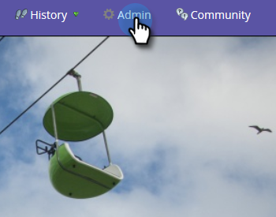

# Utilisation de l’éditeur de texte enrichi {#using-the-rich-text-editor}

L’Editeur de texte enrichi (RTE) s’affiche dans tout le marché et est disponible chaque fois que vous souhaitez ajouter ou modifier du contenu. Vous en verrez une version sur landings page, programmes, courriels, formulaires et extraits de code. Il vous suffit de cliquer sur **Modifier le brouillon** et il apparaîtra pour vous servir.

## Paramètres de l’éditeur {#editor-settings}

Le paramètre d’élément de bloc racine définit les balises qui encapsulent votre contenu. Par défaut, l’élément de bloc racine de courrier électronique utilise 
 balises. Vous avez la possibilité de changer cela en suivant les étapes ci-dessous.

>[!TIP]
>
>Bien que vous ayez la possibilité de choisir votre élément de bloc racine, nous vous recommandons toujours d’utiliser les paramètres par défaut pour optimiser la satisfaction des utilisateurs.

1. Cliquez sur **Admin**.

   

1. Cliquez sur **Courriel**.

   

1. Cliquez sur **Modifier les paramètres de l’éditeur de texte**.

   

1. Dans la liste déroulante **Éditeur de courriel / extrait de code**, sélectionnez 
 ou Aucun et cliquez sur **Enregistrer**. 
 est utilisée dans cet exemple.

   

   Si vous avez 

 dans un modèle de courrier électronique, le comportement de la source HTML suivante s’affiche lorsque vous ouvrez la section et que vous tapez &quot;Texte ici&quot; dans l’éditeur :

<table> 
 <tbody> 
  <tr> 
   <th>&lt;p&gt;</th> 
   <th>&lt;div&gt;</th> 
   <th>Aucun</th> 
  </tr> 
  <tr> 
   <td>
&lt;div class="“mktEditable”"&gt; &lt;p&gt;Le texte se trouve ici&lt;/p&gt; &lt;/div&gt;
</td> 
   <td>
&lt;div class="“mktEditable”"&gt; &lt;div&gt;Le texte se trouve ici&lt;/div&gt; &lt;/div&gt;
</td> 
   <td>
&lt;div class="“mktEditable”"&gt; Le texte se trouve ici &lt;/div&gt;
</td> 
  </tr> 
 </tbody> 
</table>

>[!TIP]
>
>Vous pouvez également modifier l’élément de bloc racine de l’éditeur de Landing page en suivant les mêmes étapes, mais en cliquant sur la liste déroulante **Éditeur de Landing page** à l’étape 4 au lieu de l’Éditeur de courriel/d’extrait de code.

>[!NOTE]
>
>L&#39;élément de bloc racine est toujours 
 pour les jetons de programme en texte enrichi.

## Fonctionnalités {#features}

Voici les fonctionnalités que vous trouverez dans un RTE.

| Icône | Nom | Contenu |
|---|---|---|
|  | Famille de polices | Choisissez votre style : nous en avons plein ! |
|  | Taille de police | Quelle taille en voulez-vous ? 25 choix, de 8px à 90px. |
|  | Styles | Choisissez Paragraphe ou six styles d’en-tête (pour les landings page). |
|  | Interligne | Choisissez la distance entre les lignes. |
|  | Couleur du texte | Noir, rouge, ou quoi que ce soit que vous vouliez. |
|  | Couleur d’arrière-plan | Mettez l’accent en évidence. |
|  | Gras | **Plus sombre et plus épais**. |
|  | Italique | *Angled, pour l&#39;accent ou les* citations. |
|  | Souligné | Place une ligne sous votre texte. |
|  | Alignement | Utilisez cette liste déroulante pour mettre en forme votre texte et vos images. Centre-les, choisissez l’alignement à gauche ou à droite ou étalonnez-le d’un bord à l’autre avec une justification complète. |  |  | Liste | Choisissez des puces ou des nombres dans la liste déroulante. Les puces sont bonnes pour les listes et les nombres avec les étapes. |
|  | Retrait | Choisissez une mise en retrait plus ou moins importante. Utilisez cette option pour les paragraphes ou tout texte à mettre en évidence. |
|  | Insérer/modifier un lien | insérer un lien vers un site Web ou un autre contenu ; il est facile d&#39;y apporter des modifications. |
|  | Insérer/modifier une image | Une image vaut mille mots. Lâchez-en un. Cliquez sur l’icône d’appareil photo pour parcourir votre studio de création. Vous pouvez déposer des images côte à côte. |
|  | Insérer un jeton | Un outil puissant, idéal pour la personnalisation des courriels et le suivi des données. Veillez à entrer une valeur par défaut. |
|  | Annuler | Oups ! Revenons en arrière et recommençons. |
|  | Rétablir | Si c&#39;est vraiment bon, revenez à l&#39;original. |
|  | Tableau | Construisez la vôtre, comme celle-ci. Un menu déroulant vous permet de le configurer. |
|  | Insérer un ancrage | Déposez l&#39;ancre ! |
|  | Ligne horizontale | Plusieurs utilisations : idéal pour diviser les sections. |
|  | Modifier HTML | Affiche l’éditeur de source HTML afin que vous puissiez ajuster votre code. |
|  | Indice | Lettres en attente basse (comme dans O`2`). |
|  | Exposant | Vous avez le pouvoir ! (2`6`). |
|  | Barré | `<s>Put a line through text, like this</s>`. |
|  | Caractère spécial | Vous voulez parler d&#39;euros ? Les maths ? Vous avez 243 choix. |
|  | Rechercher et remplacer | Recherchez et modifiez les éléments beaucoup plus rapidement que chaque instance vous-même. |
|  | Effacer la mise en forme | Renvoyez les choses à la norme. |
|  | Annuler | Appuyez sur le bouton pour dire : &quot;Peu importe.&quot; |
|  | Enregistrer | Appuyez sur le bouton pour dire : &quot;OK, je l&#39;aime.&quot; |

>[!TIP]
>
>Vous modifiez le code HTML et le texte sur des écrans distincts. Veillez à cliquer sur **Copier à partir du code HTML** dans l&#39;onglet **Texte**, puis sur **Enregistrer** pour que votre texte corresponde à votre code HTML.

>[!NOTE]
>
>Vous n’êtes pas limité aux polices dans la liste déroulante. Vous pouvez en utiliser un qui ne figure pas dans la liste en accédant au code HTML. Toutes les polices web sont prises en charge dans Marketing Cloud, mais les polices web ne fonctionnent pas de manière universelle dans tous les clients de messagerie.

## landings page {#landing-pages}

Le paramètre d’élément de bloc racine définit les balises qui encapsulent votre contenu. Par défaut, l’élément de bloc racine du landing page utilise 
 balises. Vous avez la possibilité de changer cela en suivant les étapes ci-dessous.

>[!TIP]
>
>Bien que vous ayez la possibilité de choisir votre élément de bloc racine, nous vous recommandons toujours d’utiliser les paramètres par défaut pour optimiser la satisfaction des utilisateurs.

1. Cliquez sur **Admin**.

   

1. Cliquez sur **Courriel**.

   

1. Cliquez sur **Modifier les paramètres de l’éditeur de texte**.

   

1. Dans la liste déroulante **Éditeur de Landing page**, sélectionnez 
 ou Aucun et cliquez sur **Enregistrer**. 
 est utilisée dans cet exemple.

   

   Et c&#39;est tout !

