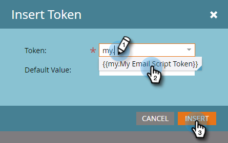

# Ajouter un jeton de script d’e-mail à votre e-mail {#add-an-email-script-token-to-your-email}

Après avoir [créé votre script d’e-mail](/help/marketo/product-docs/email-marketing/general/using-tokens/create-an-email-script-token.md), vous souhaiterez l’ajouter à un e-mail pour le voir en action. Voici comment faire.

>[!NOTE]
>
>La taille totale de tous les jetons de script insérés dans un seul email ne peut pas dépasser 100KB.

1. Accédez à la zone **[!UICONTROL Activités marketing]**.

   

1. Recherchez et sélectionnez l’e-mail auquel vous souhaitez ajouter le jeton, puis cliquez sur **[!UICONTROL Modifier le brouillon]**.

   

   >[!TIP]
   >
   >Vous pouvez également ajouter le jeton à un modèle d’e-mail si vous préférez.

1. Double-cliquez sur la zone modifiable à laquelle vous souhaitez ajouter le jeton.

   

1. Placez le curseur à l’endroit où vous souhaitez placer le jeton, puis cliquez sur l’icône Insérer un jeton .

   

1. Recherchez et sélectionnez le jeton de script de messagerie que vous avez créé précédemment et cliquez sur **[!UICONTROL Insérer]**.

   

1. Cliquez sur **Enregistrer**

   

>[!NOTE]
>
>N’oubliez pas de [approuver l’e-mail](/help/marketo/product-docs/email-marketing/general/creating-an-email/approve-an-email.md).

Lorsque cet e-mail est envoyé, le script derrière le jeton s’exécute et renseigne le contenu.
