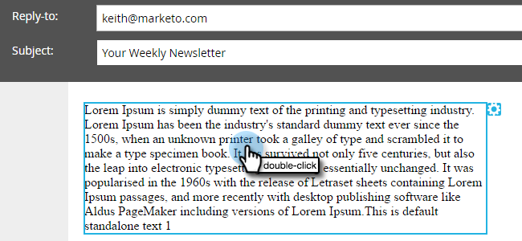

# Ajouter un jeton de script de courrier électronique à votre adresse électronique {#add-an-email-script-token-to-your-email}

Après avoir [créé votre script de courrier électronique](/help/marketo/product-docs/email-marketing/general/using-tokens/create-an-email-script-token.md), vous souhaiterez l’ajouter à un message électronique pour l’afficher en action. Voici comment.

>[!NOTE]
>
>La taille totale de tous les jetons de script insérés dans un seul courrier électronique ne peut pas dépasser 100 Ko.

1. Accédez à la zone **Activités marketing**.

   

1. Recherchez et sélectionnez le courriel auquel vous souhaitez ajouter le jeton et cliquez sur **Modifier le brouillon**.

   

   >[!TIP]
   >
   >Vous pouvez également ajouter le jeton à un modèle de courrier électronique si vous le souhaitez.

1. Cliquez avec le doublon sur la zone modifiable à laquelle vous souhaitez ajouter le jeton.

   

1. Placez le curseur à l’endroit où vous souhaitez placer le jeton, puis cliquez sur l’icône Insérer un jeton.

   

1. Recherchez et sélectionnez le jeton de script de courrier électronique que vous avez créé précédemment, puis cliquez sur **Insérer**.

   

   >[!TIP]
   >
   >Ajoutez une valeur par défaut si vous le souhaitez.

1. Cliquez sur **Enregistrer**.

   

>[!NOTE]
>
>N&#39;oubliez pas [d&#39;approuver le courriel](/help/marketo/product-docs/email-marketing/general/creating-an-email/approve-an-email.md).

C&#39;est tout ! Lorsque ce courrier électronique est envoyé, le script derrière le jeton s’exécute et remplit le contenu.
