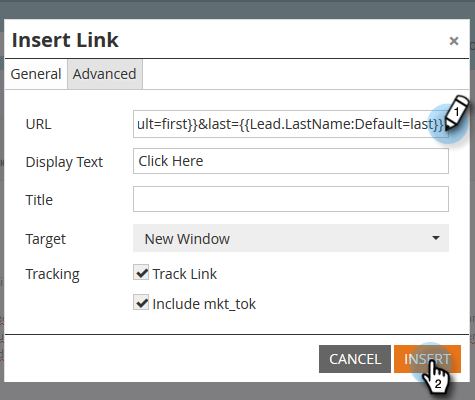

# Ajout de jetons à un lien de courrier électronique {#add-tokens-to-an-email-link}

Pour insérer des paramètres supplémentaires et spécifiques aux personnes dans vos liens, vous pouvez utiliser des jetons. Voici comment.

1. Sélectionnez votre adresse électronique et cliquez sur l’onglet **Edit Draft** (Modifier le brouillon).

   

1. Double-cliquez sur une zone modifiable.

   

1. Recherchez ou écrivez le texte du lien. Surlignez-le et cliquez sur l&#39;icône **Insérer/Modifier le lien**.

   

1. Saisissez le ou les jetons souhaités dans **URL** et cliquez sur **Insérer**.

   

1. Cliquez sur **Enregistrer**.

   

   Et c&#39;est tout !

>[!MORELIKETHIS]
>
>[Utilisation d’URL dans mes jetons](/help/marketo/product-docs/email-marketing/general/using-tokens/using-urls-in-my-tokens.md)
