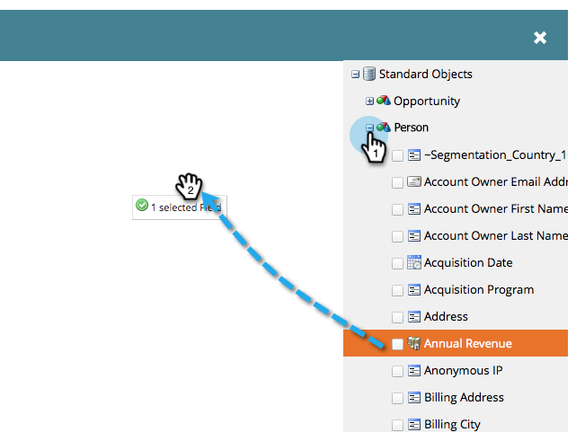

# Créer un jeton de script de courrier électronique {#create-an-email-script-token}

Pour les développeurs avancés, vous pouvez utiliser [des scripts Velocity](https://velocity.apache.org/engine/1.7/user-guide.html) dans vos courriels. Voici comment le faire.

1. Accédez à **Activités marketing**.

   

1. Recherchez et sélectionnez n’importe quel programme (Événement, Par défaut ou Engagement, etc.).

   

1. Sous l&#39;onglet **Mes jetons**, faites glisser un jeton **Script de courriel**.

   

1. Nommez votre jeton de script de courrier électronique et **cliquez pour modifier** son contenu.

   

1. Utilisez l&#39;arborescence à droite pour faire glisser les jetons **Personne, Opportunité** ou **Objet personnalisé**.

   

   >[!NOTE]
   >
   >Lors de l&#39;accès à un tableau (opportunité ou objet personnalisé), vous êtes limité aux 10 éléments les plus récents associés à la personne.

1. Notez que le jeton est coché/principal après l’avoir fait glisser dans l’éditeur de script.

   

   >[!NOTE]
   >
   >Si vous tapez des jetons en forme libre, veillez à vérifier/activer tous les jetons correspondants dans l&#39;arborescence ou ils seront traités comme du texte brut et ne fonctionneront pas.

1. Écrivez votre script dans Velocity. Voici quelques ressources utiles :

   * [Documentation sur les scripts de courrier électronique destinée aux développeurs du marketing](https://developers.marketo.com/email-scripting/)
   * [Guide de l&#39;utilisateur Velocity](https://velocity.apache.org/engine/devel/user-guide.html)
   * [Guide de référence Velocity](https://velocity.apache.org/engine/devel/vtl-reference-guide.html)
   * [Outils Velocity Javadoc](https://velocity.apache.org/tools/releases/2.0/javadoc/index.html)

1. Une fois votre script terminé, cliquez sur **Enregistrer**.

   

1. Cliquez à nouveau sur **Enregistrer**.

   

Vous pouvez désormais utiliser ce jeton dans vos courriels. Il exécute le script chaque fois qu’un courrier électronique est envoyé.

>[!MORELIKETHIS]
>
>[Ajouter un jeton de script de courrier électronique à votre adresse électronique](/help/marketo/product-docs/email-marketing/general/using-tokens/add-an-email-script-token-to-your-email.md)
