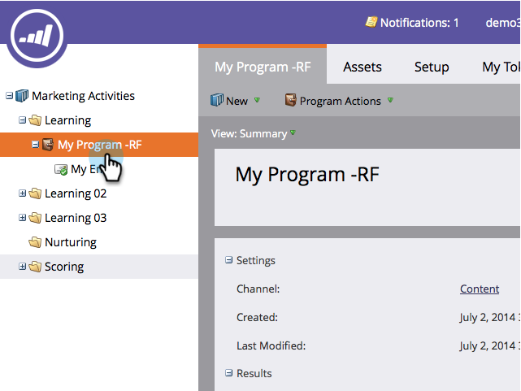
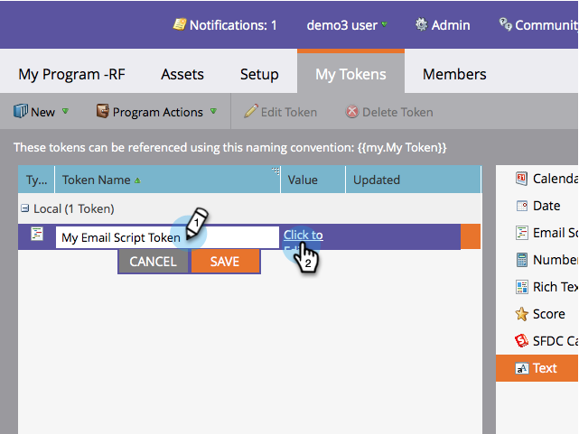
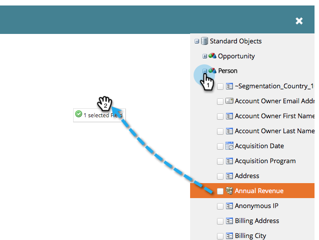
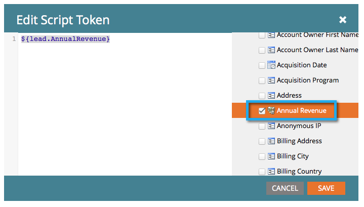
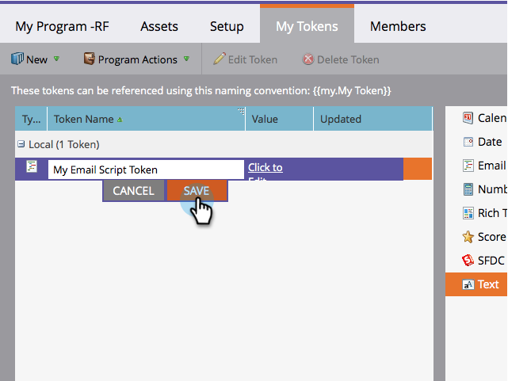

# Créer un jeton de script d’e-mail {#create-an-email-script-token}

Pour les développeurs avancés, vous pouvez utiliser des scripts [Velocity](https://velocity.apache.org/engine/1.7/user-guide.html) dans vos e-mails. Voici comment procéder.

1. Accédez à **[!UICONTROL Activités marketing]**.

   

1. Recherchez et sélectionnez un programme (Événement, Par défaut ou Engagement, etc.).

   

1. Sous l’onglet **[!UICONTROL Mes jetons]**, faites glisser un jeton **[!UICONTROL Script d’e-mail]**.

   

1. Nommez votre jeton de script de messagerie et **[!UICONTROL Cliquez pour modifier]** son contenu.

   

1. Utilisez l’arborescence de droite pour faire glisser des jetons **[!UICONTROL Personne]**, **[!UICONTROL Opportunité]** ou **[!UICONTROL Objet personnalisé]**.

   

   >[!NOTE]
   >
   >Lors de l’accès à un tableau (opportunité ou objet personnalisé), vous êtes limité aux 10 éléments les plus récents associés à la personne.

1. Notez que le jeton devient coché/actif après l’avoir fait glisser dans l’éditeur de script.

   

   >[!NOTE]
   >
   >Si vous saisissez des jetons à structure libre, veillez à vérifier/activer tous les jetons correspondants dans l’arborescence ou ils seront traités comme du texte brut et ne fonctionneront pas.

1. Écrivez votre script dans Velocity. Voici quelques ressources utiles :

   * [Documentation Sur Les Scripts De Messagerie Pour Les Développeurs Marketo](https://experienceleague.adobe.com/en/docs/marketo-developer/marketo/email-scripting)
   * [Guide de l’utilisateur Velocity](https://velocity.apache.org/engine/devel/user-guide.html)
   * [Guide de référence Velocity](https://velocity.apache.org/engine/devel/vtl-reference-guide.html)
   * [Outils Velocity Javadoc](https://velocity.apache.org/tools/releases/2.0/javadoc/index.html)

1. Une fois votre script terminé, cliquez sur **[!UICONTROL Enregistrer]**.

   

1. Cliquez encore une fois sur **[!UICONTROL Enregistrer]**.

   

Vous pouvez maintenant utiliser ce jeton dans vos e-mails. Il exécute le script chaque fois qu’un e-mail est envoyé.

>[!MORELIKETHIS]
>
>[Ajouter un jeton de script d’e-mail à votre e-mail](/help/marketo/product-docs/email-marketing/general/using-tokens/add-an-email-script-token-to-your-email.md)
